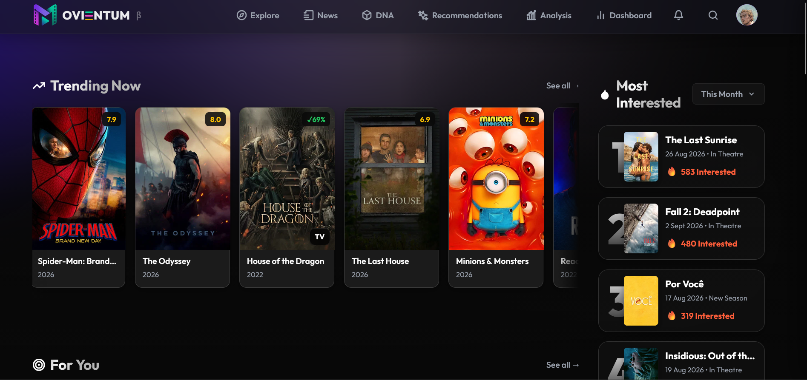
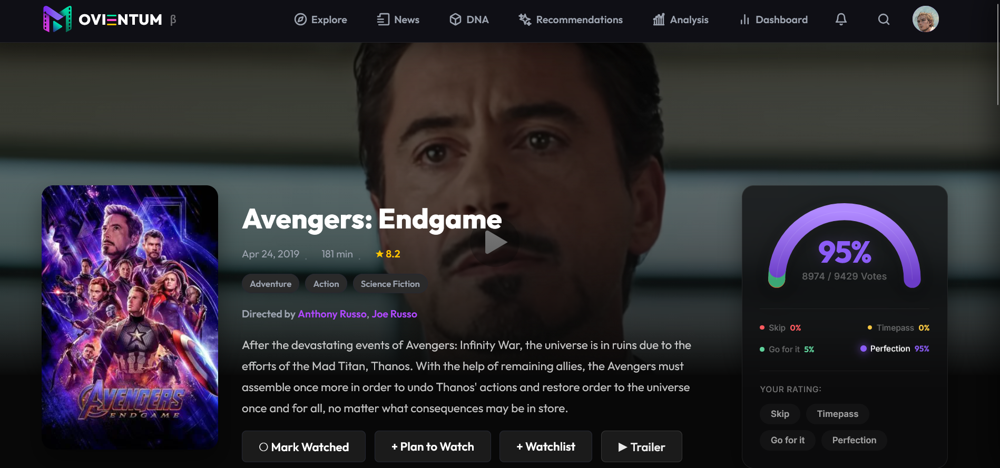
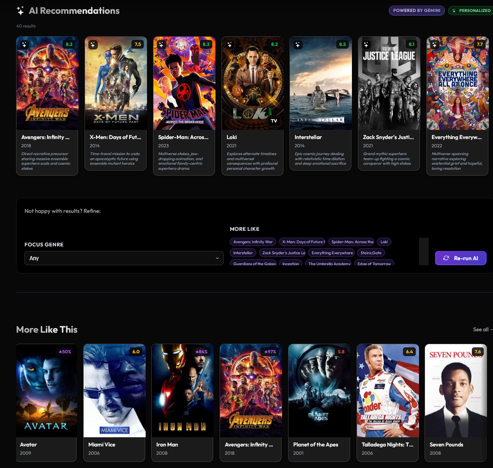
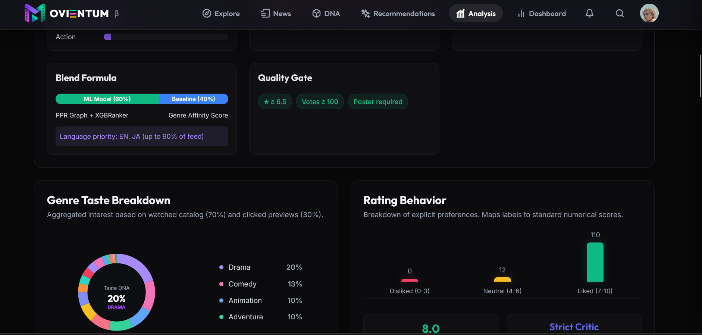

# 🎬 Movientum — Personalized Movie Recommendation Platform

> A full-stack movie discovery platform with a multi-tier ML recommendation engine as its AI core.

<p align="center">
  
</p>

---

## 🎥 Demo Video

📥 [**Download / watch the demo video**](Video/demo_video_movientum.mp4) — `Video/demo_video_movientum.mp4`

---

## 🚀 What is Movientum?

Movientum is a cinematic discovery platform where users browse movies & TV shows, rate them using a custom 4-category system, manage a watchlist, and get personalized **"For You"** recommendations that adapt to their taste over time.

---

## 🌟 Key Features

- 🎬 **Intro Landing Page**: Sleek introductory page with WebGL Aurora backdrop introducing the website.
- 🏠 **Home Hub**: A personalized homepage showcasing featured titles, trending feeds, and custom rows based on user preferences.
- 🔍 **Explore Page**: Discovery workspace to browse the library, filter by categories, genres, release era, and language.
- 🎥 **Movie & TV Details**: Rich details with media information, custom 4-category rating meter, trailers, cast/crew, and up to 100 similar items.
- 👤 **Person Profiles**: Dedicated cast and crew pages with biography details and their complete filmography.
- 🔎 **Smart Search**: Real-time autocomplete suggestions and full-text search results leveraging PostgreSQL full-text indexing.
- 📋 **User Dashboard**: Workspace displaying personalized collections, watchlist, watch history, and user's ratings.
- 📊 **User Analytics**: Visualization of user's watching behavior, favorite genres, and rating distribution patterns.
- 🔐 **JWT Auth System**: Secure authentication utilizing access/refresh tokens with immediate Redis-based logout blacklisting.
- 💬 **Interactive Feedback**: Quick ratings (`Skip`, `Timepass`, `Go For It`, `Perfection`) and thumbs up/down actions that shape your recommendations instantly.

---

## 📸 Screenshots

<p align="center">
  
  
</p>
<p align="center">
  
</p>

---

## 🔧 Technology Stack

### Frontend
| Tech | Role |
|------|------|
| **React 19 + Vite 8** | SPA framework & build tool |
| **React Router DOM 7** | Client-side routing |
| **Axios** | HTTP client with JWT interceptors |
| **OGL** | WebGL aurora background animation |
| **Vanilla CSS** | Custom design system, glassmorphism, animations |

**Deployed on:** Vercel

### Backend
| Tech | Role |
|------|------|
| **FastAPI + Python 3.13** | Async REST API |
| **SQLAlchemy 2 + Alembic** | Async ORM + schema migrations |
| **asyncpg** | Async PostgreSQL driver |
| **Celery** | Background task queue |
| **python-jose + passlib[bcrypt]** | JWT auth + password hashing |
| **Pydantic v2** | Request/response validation |

**Deployed on:** Azure with Docker

### Infrastructure & Data
| Service | Role |
|---------|------|
| **PostgreSQL 15+ (Supabase)** | Primary data store |
| **Redis 7+ (Upstash)** | Cache, JWT blacklist, Celery broker |
| **Nginx** | Reverse proxy, SSL, rate limiting |
| **TMDB API** | Movie metadata, images, trending |
| **NewsAPI** | Movie-related news articles |

### ML & Recommendation
| Tech | Role |
|------|------|
| **NetworkX + scipy.sparse** | Bipartite content graph + RWR traversal |
| **XGBoost (XGBRanker)** | Learning-to-rank model (NDCG objective) |
| **NumPy** | Feature matrix construction |

---

## 🤖 How the Recommendation Model Works

The recommendation engine is a **6-tier ML pipeline** that blends graph-based candidate retrieval with learned ranking and real-time personalization.

### Architecture

```
Content Catalog (20K items)
        │
        ▼
 [Tier 1] Data Foundation
  - content_catalog table (genres, keywords, cast, crew, era, language)
  - user_taste_profiles table (per-user affinity weight vectors)
        │
        ▼
 [Tier 2] On-Demand Feature Ingestion
  - Cache-on-demand: any new TMDB item auto-ingested on first query
        │
        ▼
 [Tier 3] Graph Candidate Retrieval
  - Bipartite content graph: items ↔ features (genre/keyword/cast/crew/era/language)
  - Personalized PageRank (RWR) from seed item → top 100 candidates
        │
        ▼
 [Tier 4] Feature Matrix + XGBRanker Inference
  - 16-feature matrix per candidate (graph proximity + content + taste intersection)
  - XGBRanker re-ranks 100 candidates → sorted by predicted relevance
        │
        ▼
 [Tier 5] Ensemble Blending (TDI)
  - Recommendations: 60% new model / 40% baseline (Team-Draft Interleaving)
  - Similar items: 70% new model / 30% baseline → 100 results
        │
        ▼
 [Tier 6] Real-Time Feedback Loop
  - Thumbs up/down, clicks, scroll-ignore update taste profile instantly
  - Interaction logs feed nightly XGBRanker retraining
```

### Graph Edge Weights (Why Each Feature Matters)

| Feature | Edge Weight | Rationale |
|---------|-------------|-----------|
| Director | 2.5 | Strongest creative signal |
| Keyword | 1.5 | Thematic specificity beyond genres |
| Genre | 1.0 | Baseline similarity |
| Cast | 0.8 | Moderate talent signal |
| Era | 0.6 | Decade-taste preference |
| Language | 0.4 | Weakest but still useful |

### XGBRanker Features (16 per candidate)

Graph-derived: `ppr_score`, `ppr_rank_norm`  
Content-derived: `vote_average`, `vote_count_log`, `popularity_log`, `recency_score`  
Personalized: `user_genre_score`, `user_cast_score`, `user_crew_score`, `user_keyword_score`, `user_era_score`, `user_language_mult`  
Structural overlap with origin: `genre_overlap_count`, `cast_overlap_count`, `same_language`, `same_era`

---

## 👤 How User Personalization Works

Every user has a `user_taste_profiles` row — a live **multi-dimensional preference scorecard** stored as JSONB weight vectors:

```
genre_weights    → {genre_id: float}    e.g. {"28": 42.5, "27": -25.0}
cast_weights     → {person_id: float}
crew_weights     → {person_id: float}   (directors, writers)
keyword_weights  → {keyword_id: float}
language_weights → {lang_code: float}   (multipliers, 1.0 = neutral)
era_weights      → {decade: float}      e.g. {"2020s": 35.0}
```

**How weights update (real-time, every interaction):**

| Signal | Profile Delta | Notes |
|--------|--------------|-------|
| 👍 Thumbs Up | `+10.0` on genres/cast/crew/era of item | Explicit — no decay |
| 🖱️ Poster Click | `+2.0` on genres | Implicit, decay applied |
| 🙈 Scroll Ignore (2s view, no click) | `−0.5` on genres | Implicit negative signal |
| 👎 Thumbs Down | `−15.0` on genres/cast/crew/era | Explicit rejection — no decay |

At inference time, these weights directly feed into the XGBRanker feature matrix — so recommendations update the moment you interact. No batch wait.

**Cold start:** New users with no interactions fall back to baseline popularity + genre onboarding weights until enough signals accumulate.

---

## 🗄 Database Schema (Key Tables)

| Table | Purpose |
|-------|---------|
| `users` | Accounts (UUID PK, bcrypt hashed password) |
| `movies` | TMDB movie catalog with FTS vector |
| `ratings` | 4-category ratings (upsert per user/movie) |
| `watch_history` | Watch records |
| `watchlist` | Saved-for-later |
| `content_catalog` | 20K+ items with genre/keyword/cast/crew/era feature arrays |
| `user_taste_profiles` | Per-user JSONB affinity weight vectors |
| `interaction_log` | Click/thumbs events used for retraining |

---

## ⚡ Caching (Redis)

| Key | TTL |
|-----|-----|
| `movie:detail:{id}` | 1 hr |
| `movie:trending` | 30 min |
| `user:recommendations:{user_id}` | 5 min |
| `rec:item:{id}:{type}:{user}:100` | 30 min |
| `search:autocomplete:{prefix}` | 5 min |
| `auth:blacklist:{jti}` | Token remaining lifetime |

---

## 💻 Local Setup

### Prerequisites
- Python 3.13+, Node.js 20+, PostgreSQL 15+, Redis 7+

### Backend
```bash
cd backend
python -m venv venv && venv\Scripts\activate
pip install -r requirements.txt
cp .env.example .env   # fill in DB_URL, REDIS_URL, TMDB_API_KEY
alembic upgrade head
uvicorn app.main:app --reload --port 8000
```

### Frontend
```bash
cd frontend
npm install
cp .env.example .env   # set VITE_API_URL=http://localhost:8000
npm run dev            # http://localhost:5173
```

### Health check
```
GET http://localhost:8000/api/health
→ {"status": "ok", "db": "ok", "cache": "ok"}
```

---

## 🔑 Key Environment Variables

```env
# Backend
DATABASE_URL=postgresql+asyncpg://...
REDIS_URL=rediss://...
SECRET_KEY=your-secret
TMDB_API_KEY=your-key
NEWS_API_KEY=your-key

# Frontend
VITE_API_URL=http://localhost:8000
```

---

## 📁 Project Structure

### Backend Layout
```
backend/
├── app/
│   ├── main.py                  # App entry point, middleware configs, startup hooks
│   ├── config.py                # Pydantic global system settings & environment variables
│   ├── celery_app.py            # Celery asynchronous task distribution orchestrator
│   ├── db/
│   │   ├── database.py          # SQLAlchemy engine, session maker, DB base definitions
│   │   ├── cache.py             # Redis integration, caching mechanisms & serialization helpers
│   │   ├── orm_models.py        # Core application models (users, movies, ratings, catalog, etc.)
│   │   └── orm_models_news.py   # Secondary model mapping for TMDB news caches
│   ├── ml/
│   │   ├── ranker.py            # XGBoost learning-to-rank wrapper, prediction & loading
│   │   ├── training.py          # Pairwise/NDCG ML training pipeline, model serialization
│   │   └── ranker.json          # Pre-compiled offline-trained ranking model weight weights
│   ├── routers/                 # API controllers receiving request payloads
│   │   ├── auth.py              # Login, register, token refresh, and logout endpoints
│   │   ├── movies.py            # Movie catalog listing, details, and trending metrics
│   │   ├── tv.py                # TV show details, TMDB sync maps
│   │   ├── person.py            # Actor/director details & filmography controller
│   │   ├── search.py            # Autocomplete, full-text, and fallback search router
│   │   ├── ratings.py           # Rating submissions, updates, deletes, and distribution details
│   │   ├── watch.py             # Watch history logs and watchlists
│   │   ├── watchlist.py         # Advanced watchlist collection utilities
│   │   ├── recommendations.py   # ML & baseline recommendations delivery
│   │   ├── feedback.py          # Real-time UI click/thumbs-up preference collection
│   │   ├── clicks.py            # Standard click-through rates monitoring
│   │   ├── notifications.py     # Custom user alert systems
│   │   ├── requests.py          # Catalog addition requests
│   │   ├── users.py             # Profile details and generic updates
│   │   ├── watching_tracker.py  # User media playbacks monitoring
│   │   ├── temp_tracker.py      # Temp interest tracker, auto-promotes to Plan to Watch
│   │   ├── internal.py          # Internal/admin endpoints (cron triggers, cleanup)
│   │   └── recommendation_signals.py # Explicit rec feedback signals (thumbs, not-interested)
│   ├── services/                # Business logic and computations layers
│   │   ├── auth_service.py      # BCrypt hashing, JWT generation, session validations
│   │   ├── tmdb_service.py      # TMDB remote integrations, candidate ingestion pipeline
│   │   ├── advanced_recs.py     # RWR graph extraction, feature compiling & XGBRanker execution
│   │   ├── graph_cache.py       # In-memory NetworkX bipartite content graph caching wrapper
│   │   ├── search_service.py    # PostgreSQL full-text queries execution
│   │   ├── rating_service.py    # Multi-category rating summaries & logic
│   │   ├── watch_service.py     # History queries, watchlist CRUD handlers
│   │   ├── feedback_service.py  # User taste profile vector increments & decays
│   │   ├── click_service.py     # Click-through tracking metrics processing
│   │   ├── analysis_service.py  # User behavior visualizations statistics computations
│   │   ├── news_service.py      # News feeds collection, parsing & caching
│   │   ├── recommendation_service.py # Baseline recommendations and fallback matching rules
│   │   └── content_recs_service.py  # Content-based filtering using metadata embeddings
│   ├── tasks/                   # Celery scheduled micro-processes (news updates, nightly runs)
│   ├── schemas/                 # Pydantic schemas validating input/output contracts
│   └── utils/                   # Shared dependency files (security, db dependencies)
├── alembic/                     # Database schemas upgrade scripts migrations history
├── scripts/
│   └── seed_catalog.py          # One-time script loading 20,000 reference media records
└── requirements.txt             # Python libraries listing (FastAPI, SQLAlchemy, networkx, xgboost)
```

### Frontend Layout
```
frontend/
├── src/
│   ├── main.jsx                 # Client entry point
│   ├── App.jsx & App.css        # Routing definitions, core app wrapper
│   ├── index.css                # Global design layout design tokens
│   ├── context/
│   │   └── AuthContext.jsx      # React global auth provider & active session lifecycle
│   ├── services/                # Axios API request clients
│   │   ├── authService.js       # Register, login, logout, refresh requests
│   │   ├── movieService.js      # Movie/TV list, details, and trending metrics
│   │   ├── searchService.js     # Predictive and autocomplete query client
│   │   ├── ratingService.js     # Rating updates & distribution calls
│   │   ├── watchService.js      # Watchlist, collections, and history APIs
│   │   ├── feedbackService.js   # Real-time preference updates dispatcher
│   │   ├── userService.js       # General profile changes
│   │   ├── watchlistService.js  # Dedicated user list groupings
│   │   ├── newsService.js       # Global movie news articles dispatcher
│   │   ├── notificationService.js # User actions system alarms
│   │   ├── watchingTrackerService.js # View durations monitoring API
│   │   ├── planToWatchService.js  # Plan-to-watch list
│   │   ├── tempTrackerService.js  # Temp interest tracker API
│   │   └── settingsService.js     # User settings
│   ├── pages/                   # Main page layouts (JS logic + matching Vanilla CSS sheets)
│   │   ├── Intro.jsx / .css     # Dynamic WebGL Aurora introductory lander
│   │   ├── Home.jsx / .css      # Profile headers, carousels, customizable movie rows
│   │   ├── Explore.jsx / .css   # Filtering catalog listings interface
│   │   ├── MovieDetail.jsx / .css # Movie metadata details, cast lists, trailers, and similar (fs disabled on mobile)
│   │   ├── TVDetail.jsx         # Television metadata panels (fs disabled on mobile)
│   │   ├── PersonPage.jsx / .css # Actor/director bios & complete filmographies
│   │   ├── Search.jsx / .css    # Autocomplete lists & full-text results page
│   │   ├── Login.jsx / .css     # Glassmorphic user entry login form
│   │   ├── Register.jsx / .css  # New user sign-up & validation flow
│   │   ├── Dashboard.jsx / .css # Watch history, watchlist collections tabs
│   │   ├── Analysis.jsx / .css  # visual statistics watch behavior metrics dashboard
│   │   ├── Recommendations.jsx  # Separate recommendations items lists
│   │   ├── WatchlistDetail.jsx / .css # Specific watchlist configurations
│   │   ├── Feedback.jsx / .css  # Website feedback options
│   │   ├── Help.jsx / .css      # Customer help documentation
│   │   ├── CompanyPage.jsx / .css # Platform production companies statistics
│   │   ├── CountryPage.jsx      # Regional filters details page
│   │   ├── AdminDashboard.jsx / .css # System administration dashboard
│   │   └── ErrorPage.jsx / .css # HTTP error responses handlers
│   ├── hooks/
│   │   ├── useScrollRestore.js  # Restore scroll on back-navigation
│   │   └── useSessionState.js   # sessionStorage-backed state hook
│   ├── utils/
│   │   ├── api.js               # Axios instance, auth interceptors, 401 → mv:logout event
│   │   ├── pageCache.js         # In-memory page-level API response cache
│   │   ├── storage.js           # LocalStorage helpers (JSON parse/stringify)
│   │   └── analytics.js         # Umami queue helpers — trackPageView, trackEvent; flushes on load
│   └── components/              # Reusable page widgets
│       ├── MovieCard.jsx / .css # Glassmorphic movie metadata cover widget
│       ├── MovieCardSkeleton.jsx # Ghost loadings templates placeholders
│       ├── RatingMeter.jsx / .css # Gauge distribution SVG ratings visualizer
│       ├── SearchBar.jsx / .css # Interactive autocomplete suggestions input field
│       ├── SearchOverlay.jsx / .css # Immersive overlay input workspace
│       ├── Navbar.jsx / .css    # App header panel with user controls
│       ├── CastCrew.jsx / .css  # Actor grid layouts detail containers
│       ├── Aurora.jsx / .css    # WebGL canvas particle glow simulation
│       ├── BorderGlow.jsx / .css# Dynamic light-up borders wrapper component
│       ├── MovieRow.jsx / .css  # Horizontally scrollable content rows
│       ├── TrailerModal.jsx / .css# Playable YouTube trailers backdrop frame
│       ├── AddContentModal.jsx / .css # Admin tool inserts
│       ├── RequestContentModal.jsx / .css # User requests
│       ├── SaveToCollectionModal.jsx / .css # Custom watch groupings selector
│       ├── WatchlistCollectionCard.jsx / .css # Visualized collections preview covers
│       ├── HomeNewsStrip.jsx / .css # Scrollable top trending news bar
│       ├── NewsCard.jsx / .css  # Individual news layout blocks
│       ├── NewsArticlesSection.jsx / .css # Grid layout of global news
│       ├── InstallPrompt.jsx / .css # PWA prompt display
│       ├── ProductionTags.jsx / .css # Production house metadata indicators
│       ├── ErrorBoundary.jsx    # JavaScript exceptions UI fallbacks handler
│       ├── PageTransition.jsx   # Page navigation transitions wrapper
│       ├── ScrollRestore.jsx    # Scroll position updates recorder
│       ├── ScrollReveal.jsx     # On-scroll entry animations
│       ├── ShinyText.jsx / .css # Textured glowing heading typography styles
│       ├── StaggerContainer.jsx  # Delayed cards entrances wrapper
│       ├── AnalyticsLoader.jsx   # Lazy Umami script mount; adblock fetch fallback; queue flush
│       ├── ColdStartLoader.jsx   # Loading state for cold-start recs
│       ├── InfoBanner.jsx        # Global info/alert banner
│       ├── FilterDropdown.jsx    # Generic filter dropdown
│       ├── WatchlistSection.jsx  # Watchlist section in dashboard
│       └── ProtectedRoute.jsx    # Auth guard wrapper for protected routes
├── index.html                   # Base HTML index template
├── vite.config.js               # Vite configurations (plugins, server ports)
└── package.json                 # Node modules catalog dependencies specifications
```
