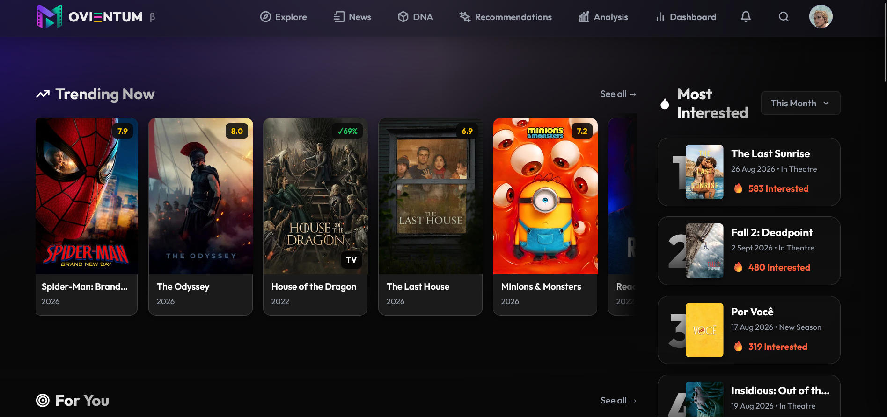
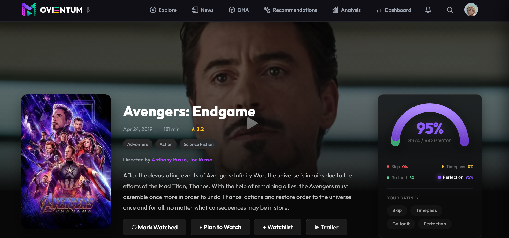
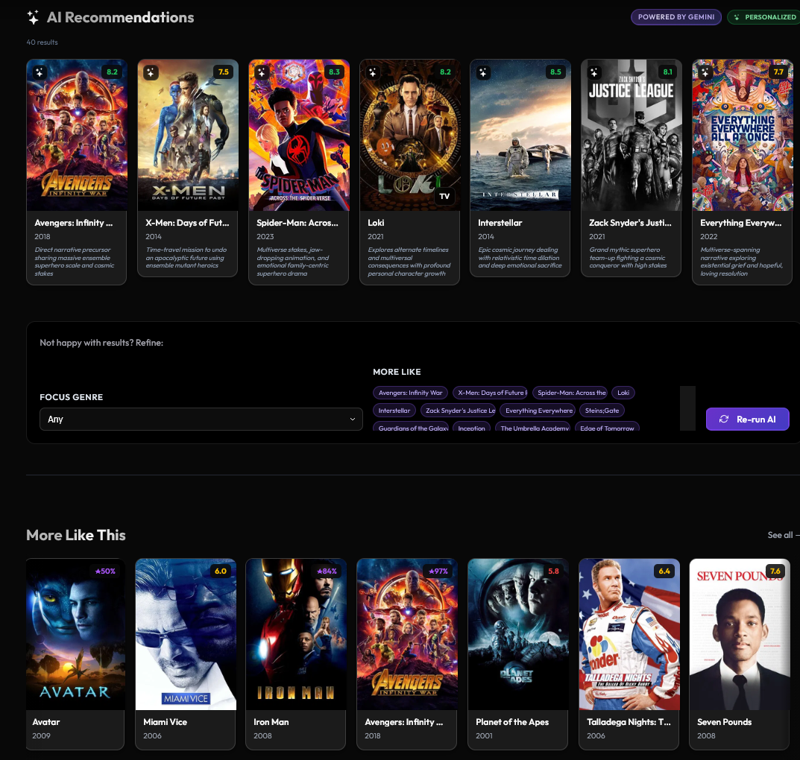
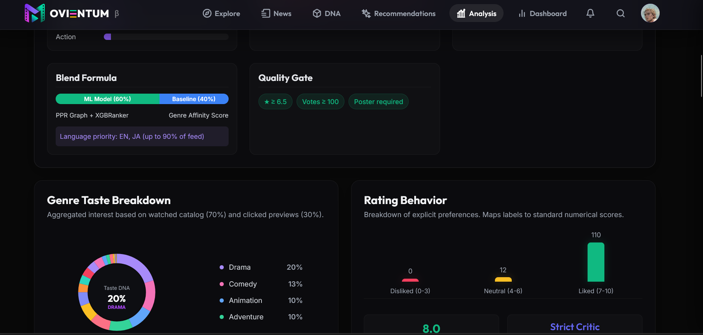

# 🎬 Movientum — Personalized Movie Recommendation Platform

> A full-stack movie & TV discovery platform with a graph + learning-to-rank recommendation engine as its AI core.

<p align="center">
  
</p>

---

## 🎥 Demo Video

[](https://www.youtube.com/watch?v=hbIGIiUothg&autoplay=1)

---

## 🚀 What is Movientum?

Movientum is a cinematic discovery platform where users browse movies and TV shows, rate them with a 4-word rating system, keep multiple watchlists, rank titles and characters in shareable tier lists, read a personalized news feed, and get **"For You"** recommendations that shift the moment they react to something — all run from an admin panel for content, ML and infrastructure jobs.

📚 **New to the codebase?** Start with [`documentation/guidance.md`](documentation/guidance.md) — it tells you which doc explains which part.

---

## 🌟 Key Features

- 🎬 **Intro Landing Page** — zero-backend parallax page with a WebGL Aurora backdrop, section rail and poster marquee.
- 🏠 **Home Hub** — trending rows, For You, a region-classified **Trailers** row (India/Anime/Hollywood/Other), watchlist strip and news strip, served as one precomputed **page bundle**; the last home page is painted instantly from a local snapshot while the server wakes.
- 🎥 **Movie & TV Details** — rating meter, cast/crew, trailers, streaming providers (OTT), franchise timeline, up to 100 similar titles, AI picks and a linked news rail.
- 🧭 **Explore** — URL-driven filters (genre, era, language, country, sort), facet hubs, and ranked franchise pages.
- 🧬 **Content DNA Recommendations** — "find more like this basket": IDF-weighted feature matching, server-side filters, a negative "less like this" basket, an ignore-taste toggle, and "why recommended" chips.
- 🤖 **AI Recommendations** — Gemini (Groq fallback) suggestions with rerun/focus-genre controls; thumbs feed the same taste profile.
- 🏆 **Tier Lists** — 515 templates in 16 categories, rank titles or characters (AniList / Fandom / TMDB), touch-friendly drag, PNG export, public share links.
- 🔎 **Smart Search** — local-first trigram + fuzzy ranking for titles and cast/crew, TMDB fallback only when local results are weak, never cached.
- 📰 **Personalized News** — admin-triggered daily snapshot stored only in Redis, auto-categorized, linked to real catalog titles, ranked per user against their taste profile.
- 📋 **Watchlist Collections** — many named lists with banner images and an OTT filter, plus watch history and a light "interested" tracker.
- 🔔 **Notifications** — new-episode alerts for followed shows and admin messages.
- 📊 **Analysis Page** — taste fingerprint, editable taste weights, engine "X-ray", feedback timeline and viewing habits.
- 🔐 **Auth** — JWT access/refresh tokens with a Redis logout blacklist, **Sign in with Google**, and device login.
- ⚙️ **Settings** — profile & avatar, password, CSV watch-history import, CSV / JSON export (the JSON is built to hand to an AI chat), feedback with screenshots, my issues, privacy, account deletion.
- 🛠️ **Admin Dashboard** — growth stats, manual job triggers with progress, API & infra health, ML controls, contact/feedback inbox, user management.
- 💬 **Instant Feedback** — ratings (`Skip`, `Timepass`, `Go For It`, `Perfection`) and thumbs up/down that reshape recommendations immediately; a thumbed-down card is replaced in place.
- 📱 **PWA** — install-to-home-screen prompt.

---

## 📸 Screenshots

<p align="center">
  
  
</p>
<p align="center">
  
</p>

---

## 🔧 Technology Stack

### Frontend
| Tech | Role |
|------|------|
| **React 19 + Vite 8** | SPA framework & build tool |
| **React Router DOM 7** | Client-side routing |
| **Axios** | HTTP client with JWT injection, 401 refresh queue, primary/secondary backend failover |
| **Recharts** | Analysis charts |
| **Motion** | Page transitions, scroll-reveal, stagger animations |
| **OGL** | WebGL Aurora background |
| **Vanilla CSS** | Custom design system, glassmorphism |

**Deployed on:** Vercel

### Backend
| Tech | Role |
|------|------|
| **FastAPI + Python 3.13** | Async REST API (modular monolith) |
| **SQLAlchemy 2 + Alembic + asyncpg** | Async ORM, migrations, PostgreSQL driver |
| **Celery** | Scheduled background jobs |
| **python-jose + passlib[bcrypt]** | JWT + password hashing |
| **Pydantic v2** | Validation + settings |
| **rapidfuzz** | Typo-tolerant search scoring |
| **scikit-learn** | News category refiner (TF-IDF + logistic regression) |
| **google-generativeai / groq** | AI recommendations |
| **OpenTelemetry (Azure Monitor)** | Traces/metrics/logs to App Insights |

**Deployed on:** Azure App Service (Docker), with Render as a failover backend

### Infrastructure & Data
| Service | Role |
|---------|------|
| **PostgreSQL (Supabase)** | Primary data store (+ Storage for watchlist banners) |
| **Redis (Upstash)** | Cache, page bundles, JWT blacklist, news snapshot, Celery broker |
| **TMDB API** | Movie/TV/person metadata, images, trailers, providers |
| **NewsAPI, Currents, ApiTube** | News sources (admin-triggered daily fetch) |
| **AniList, Fandom** | Characters for tier lists |
| **Google Gemini / Groq** | AI recommendations |
| **Azure App Insights + Grafana** | Monitoring dashboards |

### ML & Recommendation
| Tech | Role |
|------|------|
| **NetworkX + SciPy sparse** | Bipartite content graph + Personalized PageRank |
| **XGBoost (XGBRanker)** | Learning-to-rank (`rank:ndcg`), used only when it beats the baseline |
| **NumPy** | 16-feature candidate matrix |
| **Content DNA engine** | Pure retrieval/scoring modules for basket recommendations, evaluated offline |

---

## 🤖 How the Recommendation Engine Works

```
content_catalog (~20K seeded + on-demand titles)
        │
        ▼
 Bipartite graph: titles ↔ genre / keyword / cast / director / studio / era / language
        │
        ▼
 Personalized PageRank from the seed title → ~100 candidates
        │
        ▼
 16-feature matrix (graph proximity, quality, user taste, overlap with seed)
        │
        ▼
 Ranker: composite score (45% graph, 30% quality, 25% taste)
         + approved XGBRanker blended 50/50 when one exists
        │
        ▼
 Team-Draft Interleaving with a genre baseline (70 / 30)
        │
        ▼
 Final re-rank (relevance, quality, taste, recency) + exclusions → 100 results
```

### Graph edge weights

| Feature | Weight | Why |
|---|---|---|
| Director | 2.5 | Strongest creative signal |
| Studio (anime only) | 1.8 | House style separates anime |
| Keyword | 1.5 (2.4 for anime) | Theme beyond genre |
| Genre | 1.0 | Baseline similarity |
| Cast | 0.8 | Talent signal |
| Era | 0.6 | Decade taste |
| Language | 0.4 | Weak but useful |

### "For You" feed

Seeds are picked from the user's watch history and watchlist in buckets and rotate every 15 minutes: **established taste 65%**, **diverse (older interests) 17.5%**, **recent 12.5%**, **fresh popular 7.5%**. The merged pool is ordered by relevance + quality + taste + novelty, spread out so genres/languages do not clump, and guaranteed at least 3 other-language titles once a user's main language passes their threshold (default 70%).

### Nightly retraining

At 03:30 IST the XGBRanker retrains on the last 30 days of `interaction_log`. A model goes live only if it has enough users/rows **and** beats the composite score on held-out users (`ranker_meta.json` approval); otherwise ranking stays unchanged.

### Content DNA and AI picks

- **Content DNA** (`services/dna/`) builds one IDF-weighted profile from a basket of titles and scores candidates on keyword (0.30), genre (0.22), crew (0.12), cast (0.10), studio (0.06), graph (0.12) and quality, with language/type gates and MMR diversity.
- **AI picks** (`ai_rec_service.py`) prompt Gemini (Groq fallback), dedupe against the user's past AI thumbs, and resolve every suggestion to a real TMDB title.

---

## 👤 How Personalization Works

Every user has one `user_taste_profiles` row: JSONB weight maps for genres, cast, crew, keywords, languages and eras, plus negative weights.

| Signal | Genre change | Other changes | Training label |
|---|---|---|---|
| ✅ Watched | +15 | cast/crew/era +10, keyword +8 | 5 |
| 👍 Thumbs up | +10 | cast/crew/era +10, keyword +5 | 4 |
| 📌 Added to watchlist | +8 | cast/crew/era +5, keyword +4 | 4 |
| 🖱️ Click | +2 | keyword +1 (fades over time) | 3 |
| ↩️ Removed from watchlist / un-watched | −8 / −15 | matching negatives | 2 |
| 👎 Thumbs down | −15 | cast/crew/era −15, keyword −8 | 1 |

- Explicit signals never fade; clicks decay with a ~69-day half-life.
- A thumbs-down also hides the title for **90 days** (`rec_suppression`).
- The request returns immediately; the profile update, training row and cache busting happen in a background task.
- Every signal is logged with the exact 16-feature snapshot and the surface it came from, which is what nightly retraining learns from.
- News thumbs are separate and never change movie recommendations.

---

## 🗄 Key Tables

| Table | Purpose |
|-------|---------|
| `users` | Accounts (UUID, bcrypt hash nullable for Google-only users, `google_sub`, role, rec preferences) |
| `movies` | Movies **and** TV (composite `(id, type)` key) with full-text search vector |
| `ratings` | 4-category ratings, one per user/title |
| `watch_history`, `watchlist` | Watch records and the single watchlist (taste signals) |
| `watchlist_collections`, `watchlist_items` | Multi-list watchlists (main UX) |
| `content_catalog` | Title features for the graph (genres, keywords, cast, crew, studio, era, language) |
| `user_taste_profiles` | Per-user taste weights |
| `interaction_log` | Feedback events + feature snapshots (training data) |
| `rec_suppression` | Titles hidden after a thumbs-down (90 days) |
| `ai_rec_memory`, `ai_rec_sessions` | AI-pick thumbs and request log |
| `tier_lists` | Saved tier boards (JSONB) with public share ids |
| `people` | Local cast/crew search index |
| `watching_tracker`, `temp_tracker`, `notifications` | Followed shows, interest markers, alerts |
| `feedback`, `requested_content`, `rating_needed` | Bug reports, missing-title requests, meter requests |

News is **not** stored in PostgreSQL.

---

## ⚡ Caching (Redis)

| Data | TTL |
|-----|-----|
| Movie/TV detail, credits, trailers, providers | 7 days |
| Trending | 10 h |
| Home page bundle | 30 min |
| Detail page bundle | 7 days (shared) + 6 h (per user) |
| Similar items | 6 h per user / 24 h guest |
| For You pool | 15 min (3 min right after a library change) |
| Taste profile | 2 min |
| Dashboard lists | 48 h, busted on write |
| `auth:blacklist:{jti}` | Remaining token lifetime |
| News snapshot `news:v3:{gen}:*` | Until the next admin fetch |

Every cached endpoint uses cache-aside with an in-flight lock against stampedes. Search is deliberately not cached.

---

## 📰 News (Redis-only)

An admin presses **News Daily Fetch**: NewsAPI + Currents + ApiTube → deduplicate to ~500 articles → categorize (rules + a TF-IDF/logistic-regression refiner) → link to catalog titles → write a new generation `news:v3:{N+1}:*` → atomically swap the pointer and delete the old one. Readers never see a half-built feed. "For You" scores each article against the user's taste profile (genre, people, linked titles, keywords, source, recency, minus seen/negative), then applies a source/category diversity pass.

---

## ⏰ Background Jobs (Celery beat, IST)

| Time | Job |
|---|---|
| 02:30 | Expire stale trailers from the trailer index |
| 03:00 | TMDB sync (refresh popular titles into the catalog) |
| 03:30 | Nightly XGBRanker retrain (approved models only go live) |
| 03:45 | Rebuild the title index used to link news to catalog titles |
| 04:00 | New-episode check → notifications for followed shows |
| Every 3 h | Trailer index refresh, one region per slot (Hollywood :00, India :10, Anime :20, Other :30, All :40) |

News is fetched on demand from the admin panel (**News Daily Fetch**), not on a schedule. On startup the API also warms the recommendation graph and cleans up unpopular, unreferenced titles older than 30 days.

---

## 💻 Local Setup

### Prerequisites
- Python 3.13+, Node.js 20+, PostgreSQL 15+, Redis 7+

### Backend
```bash
cd backend
python -m venv venv && venv\Scripts\activate
pip install -r requirements.txt
cp .env.example .env   # fill in DB URLs, REDIS_URL, TMDB keys, JWT_SECRET_KEY, ...
alembic upgrade head
uvicorn app.main:app --reload --port 8000
```

### Frontend
```bash
cd frontend
npm install
npm run assets:webp    # generates the .webp images some pages import
cp .env.example .env   # set VITE_API_URL=http://localhost:8000
npm run dev            # http://localhost:5173
```

### Health check
```
GET http://localhost:8000/api/health
→ {"status": "ok", "version": ..., "environment": ..., "dependencies": {"database": "ok", "cache": "ok"}}
```

---

## 🔑 Key Environment Variables

```env
# Backend
TMDB_API_KEY=...
TMDB_READ_ACCESS_TOKEN=...
DATABASE_URL=postgresql://...          # sync, Alembic
ASYNC_DATABASE_URL=postgresql+asyncpg://...
DB_PASSWORD=...
REDIS_URL=rediss://...
JWT_SECRET_KEY=...
GOOGLE_CLIENT_ID=...
GEMINI_API_KEY=...
GROQ_API_KEY=...
NEWS_API_KEY=...
CURRENTS_API_KEY=...
APITUBE_API_KEY=...
CELERY_BROKER_URL=...
ALLOWED_ORIGINS=...                    # comma-separated, must include the deployed frontend origin
SUPABASE_URL=...                       # Storage for watchlist banners / uploads
SUPABASE_SERVICE_ROLE_KEY=...
DEBUG=false                            # true only locally — enables /docs and verbose logs
APPLICATIONINSIGHTS_CONNECTION_STRING= # optional telemetry
GRAFANA_*_URL=                         # optional dashboards embedded in the admin panel

# Frontend (baked in at build time)
VITE_API_URL=http://localhost:8000
VITE_API_URL_SECONDARY=https://fallback-backend-url
VITE_GOOGLE_CLIENT_ID=...
VITE_UMAMI_WEBSITE_ID=...
VITE_UMAMI_SCRIPT=/st/track.js
```

See `backend/.env.example` and `frontend/.env.example` for the full lists. Never commit `.env` files or Google `client_secret*.json` downloads (both are gitignored).

---

## 🚢 Deployment

| Part | Where | How |
|---|---|---|
| Frontend | Vercel | Root directory `frontend`, build `npm run build`, output `dist`. `vercel.json` handles SPA rewrites, asset cache headers and the Umami `/st/*` proxy. |
| Backend (primary) | Azure App Service | Docker image built from `backend/Dockerfile` (`backend/steps.txt` has the build/push commands). |
| Backend (failover) | Render | Same image; the frontend switches to `VITE_API_URL_SECONDARY` automatically when the primary is down. |
| Database | Supabase PostgreSQL | `alembic upgrade head` against `DATABASE_URL`. A few tables (`rating_needed`, `watching_tracker`, `temp_tracker`, `notifications`) are also created at startup. |
| Cache / broker | Upstash Redis | Cache, page bundles, JWT blacklist, news snapshot, Celery broker. |
| Workers | `celery worker` + `celery beat` | `docker-compose up` runs API, worker and beat together. |

**Pre-launch checklist**
- `DEBUG=false` and a strong `JWT_SECRET_KEY` in production.
- `ALLOWED_ORIGINS` includes the real frontend domain.
- `VITE_API_URL` set on Vercel (otherwise the app falls back to the built-in Azure URL), then redeploy.
- Create an admin with `python scripts/create_admin.py`.
- `GET /api/health` reports `database: ok` and `cache: ok`.
- `npm run lint` (0 errors) and `npm run build` pass in `frontend/`.

---

## 📁 Project Structure

```
Movientum/
├── backend/
│   ├── app/
│   │   ├── main.py            # App, middleware (CORS, gzip), lifespan, router registration
│   │   ├── config.py          # Settings — the only place env vars are read
│   │   ├── celery_app.py      # Celery + beat schedule (IST)
│   │   ├── telemetry.py       # OpenTelemetry → App Insights
│   │   ├── routers/           # HTTP only: movies, tv, pages, search, explore, auth, ratings, watch,
│   │   │                      # watchlist, recommendations, rec-feedback, ai-recs, news, trailers,
│   │   │                      # tierlist, users, notifications, contact, feedback, admin, internal, …
│   │   ├── services/          # Logic: advanced_recs, recommendation_service, feedback_service,
│   │   │   │                  # graph_cache, ranking_utils, search_service, tmdb_service,
│   │   │   │                  # news_* (fetch/service/ranking/nlp/taxonomy/entity linker),
│   │   │   │                  # ai_rec_service, tier_template_service, character_service, …
│   │   │   └── dna/           # Content DNA engine (idf, profile, retrieval, scoring, graph_rwr, service)
│   │   ├── ml/                # ranker.py, training.py, ranker.json, ranker_meta.json
│   │   ├── db/                # database.py, orm_models.py, cache.py (all Redis keys + TTLs)
│   │   ├── repositories/      # search, watchlist, tier-list SQL
│   │   ├── tasks/             # sync, retrain, episodes, trailers, news fetch, nightly chain
│   │   ├── data/              # baked tier templates/covers, franchises, explore taxonomy
│   │   ├── schemas/           # Pydantic shapes
│   │   └── utils/             # JWT, auth deps, storage, persistence thresholds
│   ├── alembic/               # Migrations
│   ├── debug/                 # Scratch probes + evaluation harnesses
│   └── scripts/               # Seed, import and ops scripts
├── frontend/                  # See frontend/README.md
│   ├── public/                # Static assets, avatars, manifest, robots.txt, sitemap.xml
│   ├── vercel.json            # Rewrites, cache headers, analytics proxy
│   └── src/
│       ├── pages/             # One component + CSS per route (incl. analysis/, settings/)
│       ├── components/        # Cards, rows, feedback control, search overlay, tierlist/, …
│       ├── services/          # One API wrapper per backend area
│       ├── hooks/             # Scroll restore, session state, tier drag, feedback buffer
│       ├── utils/             # api.js (client + failover), storage.js, tier export, analytics
│       └── context/           # AuthContext
├── documentation/             # Plain-language docs — start at guidance.md
├── AI_Context/                # File, route, service, DB and flow maps
├── map.md                     # Generated structure/exports index
├── plans/                     # Design documents (historical)
└── fedpcl/                    # Separate federated-learning research project
```

---

## 🧪 Verification

There is no automated test suite. Changes are verified with scripts run from `backend/` with the venv active:

- `backend/debug/scratch_*.py` — one-off probes (hit an endpoint, inspect a record, clear a key).
- `backend/debug/scratch_*_eval.py`, `dna_offline.py` — quality evaluation for search, DNA and the ranker, using catalog snapshots where possible.
- `backend/debug/scratch_perf_check.py` — before/after latency with a gate that fails if recommendation order changes.
- `backend/scripts/` — seeding (`seed_catalog.py`, `seed_people.py`), imports (`load_ratings.py`) and ops (`create_admin.py`).

Frontend: `npm run lint` (0 errors; React Compiler advisory rules are warnings) and `npm run build`. See [`frontend/README.md`](frontend/README.md) for frontend details.
