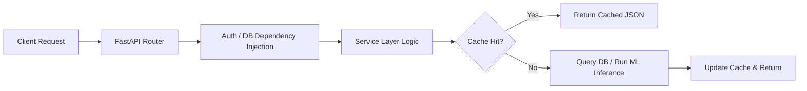

# Backend Architecture (Modular Monolith)

## Overview & Architecture

Movientum's backend is a strictly defined **Modular Monolith** built on `FastAPI`. It avoids the operational overhead of microservices while maintaining clean boundary separations inside a single codebase.

The system relies on asynchronous I/O (`asyncio`, `asyncpg`, `aioredis`) to handle high concurrency efficiently. Background processing and heavy ML tasks are offloaded to **Celery**.

---

## Logics & Business Rules

### Why a Modular Monolith?
- **Shared Data Models**: Allows the ML ingestion loop and the FastAPI routers to seamlessly share `SQLAlchemy` ORM models without complex gRPC serialization.
- **Simpler Deployments**: A single Docker container (or cluster of identical containers) scales the entire API tier horizontally behind a load balancer.
- **Graph Cache Locality**: The `nx.Graph` singleton for recommendation engine traversal requires in-memory RAM. Distributing this across microservices would incur massive network latency or require complex RedisGraph setups. A monolith keeps the graph in the API server's RAM.

---

## Code Structure & Detailed Logic

### Directory Organization (`backend/app/`)
- `routers/`: Contains all FastAPI endpoint definitions, split by feature (e.g., `movies.py`, `recommendations.py`, `users.py`).
- `services/`: Contains all core business logic, isolating routers from database queries. (e.g., `tmdb_service.py`, `feedback_service.py`, `advanced_recs.py`).
- `db/`: Handles connection pooling (`database.py`), schema definitions (`orm_models.py`), and Redis connection/keys (`cache.py`).
- `ml/`: Contains XGBRanker inference wrappers (`ranker.py`) and Celery training loops (`training.py`).
- `main.py`: The application entry point. Initializes routes, CORS, and the OpenTelemetry exporter.

### Dependency Injection Pattern
FastAPI's `Depends` is used heavily to inject database sessions and current user state into routers, ensuring that components remain testable and stateless.
```python
@router.post("/feedback/")
async def submit_feedback(
    payload: FeedbackRequest,
    db: AsyncSession = Depends(get_db),
    user_id: str = Depends(get_current_user_id)
):
    await apply_feedback(db, user_id, payload.tmdb_id, payload.signal_type)
```

---

## Tables & Summaries

### Core Backend Stack
| Technology | Role |
|---|---|
| **FastAPI** | Asynchronous web framework. |
| **SQLAlchemy 2.0** | Asynchronous ORM (`asyncpg`). |
| **Pydantic V2** | Request validation and Settings management. |
| **Celery** | Distributed task queue for asynchronous jobs. |
| **NetworkX** | In-memory bipartite graph processing. |
| **XGBoost** | Learning-to-Rank ML inference (`XGBRanker`). |

---

## Workflows & Lifecycles

### Request Lifecycle

