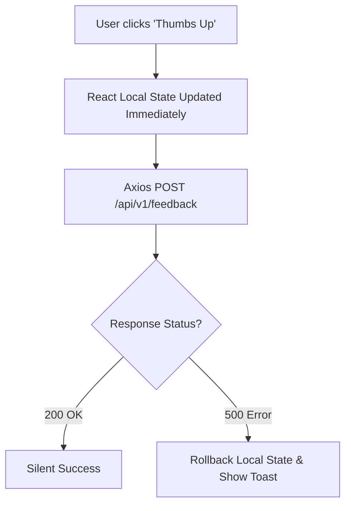

# Frontend Architecture (React SPA)

## Overview & Architecture

The Movientum frontend is a highly dynamic **Single Page Application (SPA)** built with **React 19** and **Vite**. It eschews heavier meta-frameworks like Next.js in favor of a purely client-side rendered approach, relying on the FastAPI backend for all data and caching.

---

## Logics & Business Rules

### Rendering Strategy (CSR)
Because Movientum is a heavily personalized recommendation platform where >90% of content views are unique to the authenticated user's taste profile, SSR (Server-Side Rendering) offers minimal caching benefits. A pure CSR approach allows the UI to instantly react to user interactions (e.g., thumbs-up feedback) using client-side state, while the background asynchronously updates the server.

### Aesthetic & Animation Requirements
The frontend relies heavily on modern animation libraries to achieve a premium, cinematic feel:
- **`motion` (Framer Motion)**: Used for layout transitions, micro-interactions, and presence detection.
- **`ogl`**: A minimal WebGL library used for high-performance visual effects.

---

## Code Structure & Detailed Logic

### Dependencies (`package.json`)
```json
"dependencies": {
  "react": "^19.2.6",
  "react-dom": "^19.2.6",
  "react-router-dom": "^7.15.1",
  "motion": "^12.40.0",
  "ogl": "^1.0.11",
  "axios": "^1.16.1",
  "react-icons": "^5.6.0"
}
```

### Build & Tooling
- **Vite**: Used for lightning-fast HMR (Hot Module Replacement) during development and highly optimized Rollup builds for production.
- **ESLint**: Strictly enforced using React Hooks and React Refresh plugins.

---

## Tables & Summaries

### Key Technologies

| Technology | Purpose |
|---|---|
| **React 19** | Core UI library. |
| **Vite** | Build tool and dev server. |
| **React Router v7** | Client-side routing. |
| **Axios** | Promise-based HTTP client to interact with the FastAPI backend. |
| **Motion** | Fluid animations and gesture support. |

---

## Workflows & Lifecycles

### Frontend Data Flow

