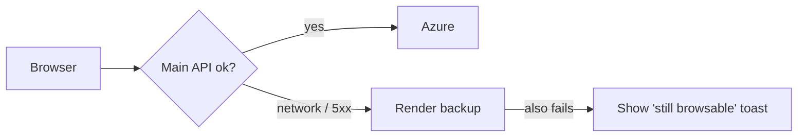

# Deployment and Servers

Movientum is spread over several free-tier hosts. Each one does one job.

| Piece | Host | Notes |
|---|---|---|
| Website | Vercel | Static files on a CDN. `vercel.json` sends every path to the SPA and proxies Umami analytics under `/st/*` so ad blockers do not drop it |
| Main API | Azure App Service (Docker) | `https://movientum.azurewebsites.net`. Sleeps when idle; waking takes 15–30 s |
| Backup API | Render (Docker) | Same image. The frontend switches to it when the main API fails |
| Database | Supabase PostgreSQL | |
| Cache, token blacklist, news, Celery broker | Upstash Redis | TLS required. Free tier may evict keys under memory pressure |
| Monitoring | Azure App Insights (+ Grafana dashboards) | OpenTelemetry traces and metrics |

## How failover works



The logic lives in `frontend/src/utils/api.js`. Token refresh also tries the backup.

## Same image, three roles

One Docker image can run as:
- **API**: `uvicorn app.main:app`
- **Celery worker**: runs queued jobs
- **Celery beat**: the scheduler. Must run as a single instance, or scheduled jobs run twice.

On the free hosts, beat is not always running reliably, so the **admin panel's manual triggers** (`/internal/trigger/{task}`, run in-process) are the main way jobs actually run.

## Why not scale up

The owner cannot pay for bigger plans or "Always On". So the project never adds workers, larger instances, keep-alive pings or recurring warm-up jobs. Speed must come from code: caching, gzip, page bundles, background tasks, smaller payloads. Cold starts and Upstash eviction are accepted limits.

## Building and pushing the image

```bash
docker build --build-arg CODE_VERSION=%RANDOM% -t patidarmithil/movientum-backend:latest .
docker push patidarmithil/movientum-backend:latest
```

`CODE_VERSION` changes every build so Docker re-copies the code even when dependencies did not change.
