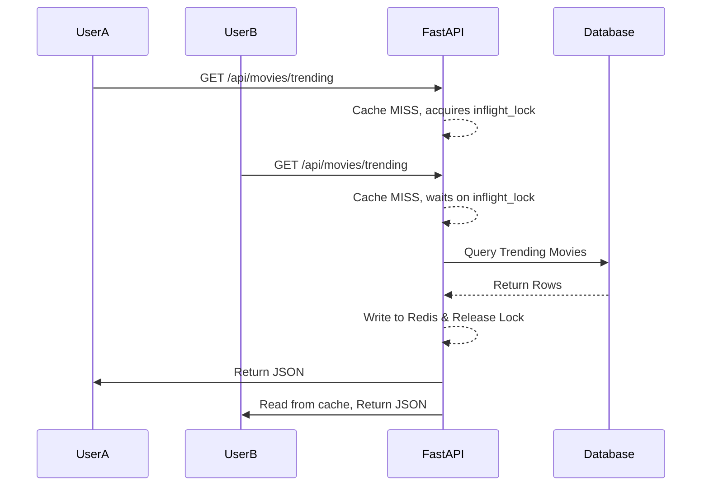

# Scalability Planning

## Overview & Architecture

Movientum is designed to handle spikes in traffic (e.g., viral movie releases, push notifications) through aggressive edge/memory caching, asynchronous connection pooling, and background task offloading.

---

## Logics & Business Rules

### 1. Database Connection Pooling (`asyncpg`)
Because serverless APIs and scalable containers can exhaust Postgres connection limits rapidly, Movientum bypasses raw connections in favor of `asyncpg` combined with Supabase's built-in PgBouncer pooling (referenced via `database_pool_url`).

### 2. Cache Stampede Protection (Thundering Herd)
A sudden spike in traffic for a cache-missed key (e.g., a newly trending movie) could DDOS the database. The system uses an `asyncio.Event` lock (`inflight_lock` in `cache.py`) so that only the very first concurrent request queries the DB; the rest wait for the first request to populate the cache.

### 3. ML Inference Scalability
The `XGBRanker` prediction step in `ranker.py` is entirely CPU-bound.
- **Tree Method**: Set to `hist` (histogram), which is highly optimized for CPU inference.
- **Graph Cache**: The bipartite graph is stored in API server RAM as a singleton to avoid network round-trips during Random Walk traversals. Horizontal scaling of the API simply duplicates the graph into the RAM of the new nodes.

---

## Code Structure & Detailed Logic

### Task Offloading via Celery
Any task that takes longer than ~100ms or involves 3rd party APIs is offloaded.
- **TMDB Fallbacks**: If a movie isn't in the local DB, it is fetched on-the-fly, but heavy backfilling of cast/crew is queued to Celery.
- **Model Retraining**: Triggered purely in the background by `celery_beat`, preventing any impact on the live web server during the 3:30 AM data crunch.

---

## Tables & Summaries

### Scalability Bottlenecks & Mitigations

| Bottleneck | Mitigation Strategy |
|---|---|
| **DB Connection Limits** | `asyncpg` + Supabase PgBouncer |
| **High Traffic on Missing Cache** | `inflight_lock` in `cache.py` |
| **Heavy Graph Traversal** | Singleton in-memory `nx.Graph`, pre-warmed on app startup |
| **3rd Party API Rate Limits (TMDB)** | Permanent local DB cataloging + Redis caching |
| **ML Training CPU Load** | Offloaded entirely to isolated Celery worker containers |

---

## Workflows & Lifecycles

### Cache Stampede Mitigation Flow

