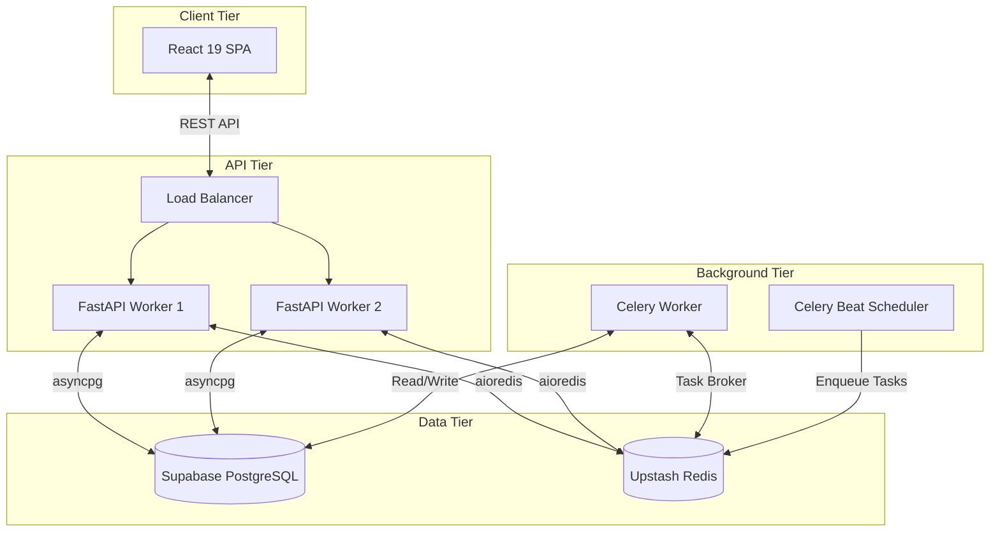

# Master System Architecture

## Overview & Architecture

Movientum is an advanced, full-stack movie/TV recommendation platform. It operates as a **Modular Monolith** with an integrated, ML-driven recommendation engine natively embedded within the backend API, removing the need for complex microservice architectures.

### The 4 Pillars of the System
1. **The Client**: A React 19 CSR (Client-Side Rendered) SPA hosted on a global CDN.
2. **The API Tier**: A stateless FastAPI backend container managing auth, database routing, and real-time inference.
3. **The Worker Tier**: Celery containers handling TMDB ingestion and heavy nightly ML retraining.
4. **The Data Tier**: Supabase (PostgreSQL) for persistence and Upstash (Redis) for high-speed caching.

---

## Code Structure & Detailed Logic

### Technology Stack
- **Frontend**: React 19, Vite, React Router, Framer Motion, Tailwind/CSS.
- **Backend Core**: Python 3.11, FastAPI, Uvicorn, Pydantic-Settings.
- **Database / ORM**: PostgreSQL, SQLAlchemy 2.0 (asyncpg), Alembic.
- **Caching / Task Queue**: Redis, Celery.
- **Machine Learning**: NetworkX (Graph RWR), XGBoost (`XGBRanker`).
- **Observability**: Azure Monitor OpenTelemetry.

### Component Interactions
- The **Frontend** exclusively communicates with the backend via REST API (`axios`). It maintains no direct connections to the database.
- The **FastAPI Backend** acts as the orchestrator. For recommendations, it queries the DB for taste profiles, queries the RAM-based NetworkX graph for candidates, runs the `XGBRanker` inference, and interleaves the results before returning JSON to the client.
- The **Celery Scheduler** runs a nightly job pulling the last 30 days of user interactions from the DB, training a new XGBoost model, and saving the `ranker.json` artifact to the local disk, where the FastAPI workers hot-reload it.

---

## Tables & Summaries

### Architecture Component Map

| Component | Responsibility | Scaling Model |
|---|---|---|
| **Vercel Edge** | Serve static HTML/JS/CSS | Automatic Edge Scaling |
| **FastAPI Containers** | Handle HTTP requests, run ML inference | Horizontal (Load Balanced) |
| **Celery Worker** | TMDB Ingestion, Background tasks | Horizontal (Queue Depth) |
| **Celery Beat** | Trigger nightly cron jobs | Singleton (Strictly 1 Instance) |
| **Supabase DB** | Store users, catalogs, profiles, logs | Vertical (Compute/Storage Scaling) |
| **Upstash Redis** | Cache API responses, Celery Broker | Serverless (Usage Based) |

---

## Workflows & Lifecycles

### Full System Diagram

