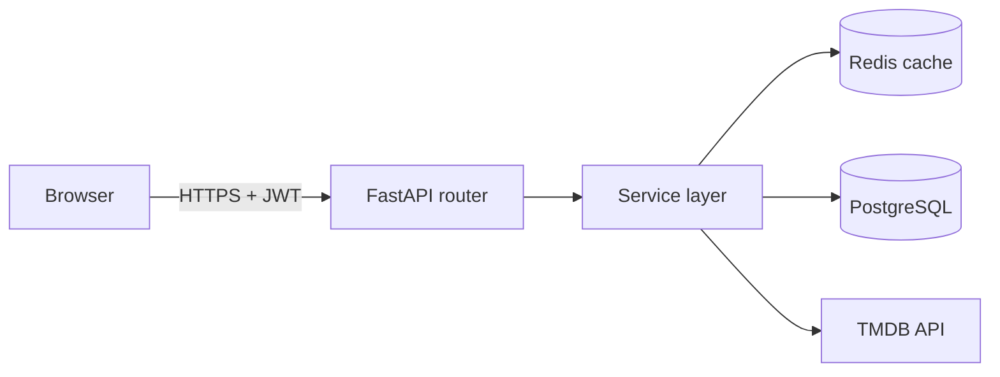

# System Architecture

**Read this first.** It explains what Movientum is made of and how the pieces talk to each other.

## What the system is

Movientum is a movie and TV discovery site. Users browse titles, rate them, keep watchlists, build tier lists, read news, and get recommendations that learn from what they do.

It has four parts:

| Part | Technology | Where it runs |
|---|---|---|
| Website (client) | React 19 + Vite single-page app | Vercel |
| API (server) | FastAPI, Python, one codebase ("modular monolith") | Azure App Service (Docker), Render as backup |
| Database | PostgreSQL | Supabase |
| Cache + small data store | Redis | Upstash |

Outside services it calls: **TMDB** (all movie/TV/person data), **NewsAPI / Currents / ApiTube** (news), **Gemini** with **Groq** as fallback (AI recommendations), **AniList / Fandom** (anime and cartoon characters for tier lists), **Google Identity** (sign-in), **Azure App Insights** (monitoring).

## How a request moves

```mermaid
flowchart LR
    B[Browser] -->|HTTPS + JWT| A[FastAPI router]
    A --> S[Service layer]
    S --> R[(Redis cache)]
    S --> P[(PostgreSQL)]
    S --> T[TMDB API]
```

1. The React app calls the API through one Axios client (`frontend/src/utils/api.js`).
2. A **router** receives the request, checks the login token, and hands work to a **service**.
3. The service first looks in **Redis**. If the answer is cached, it returns it.
4. If not, it reads **PostgreSQL**, and calls **TMDB** only when the title is not stored locally. The result is cached for next time.

## Key design choices (and why)

- **One backend, not microservices.** The recommendation graph lives in the API process's memory. Splitting into services would mean shipping that graph over the network on every request.
- **Everything runs on free tiers.** Speed comes from code (caching, compression, background work), never from bigger servers. A cold Azure start takes 15–30 seconds, so the frontend waits up to 120 seconds and fails over to the Render backup if the primary is down.
- **News lives only in Redis**, never in PostgreSQL, to keep the database small.
- **Titles are fetched on demand.** If someone opens a movie the database does not have, it is pulled from TMDB, saved, and added to the recommendation catalog.
- **Page bundles.** Home, movie, TV, person and dashboard pages are each served from one precomputed Redis key, so a page load is one fast read instead of many calls.

## Background work

- **Celery beat** (scheduled, IST time): TMDB sync 03:00, ranker retrain 03:30, news title index 03:45, episode check 04:00, trailer refresh every 3 h.
- **Admin triggers** (`/internal/trigger/{task}`): the admin panel can run any of those jobs on demand, plus the News Daily Fetch, which is the only way news enters the system.
- **Startup tasks**: after the port opens, the server creates four raw-SQL tables, warms the recommendation graph, and deletes old unused movies.

## Where to go next

- Backend code layout: `backend_architecture.md`
- Frontend code layout: `frontend_architecture.md`
- Recommendations: `../ml_and_recommendations/recommendation_engine_overview.md`
