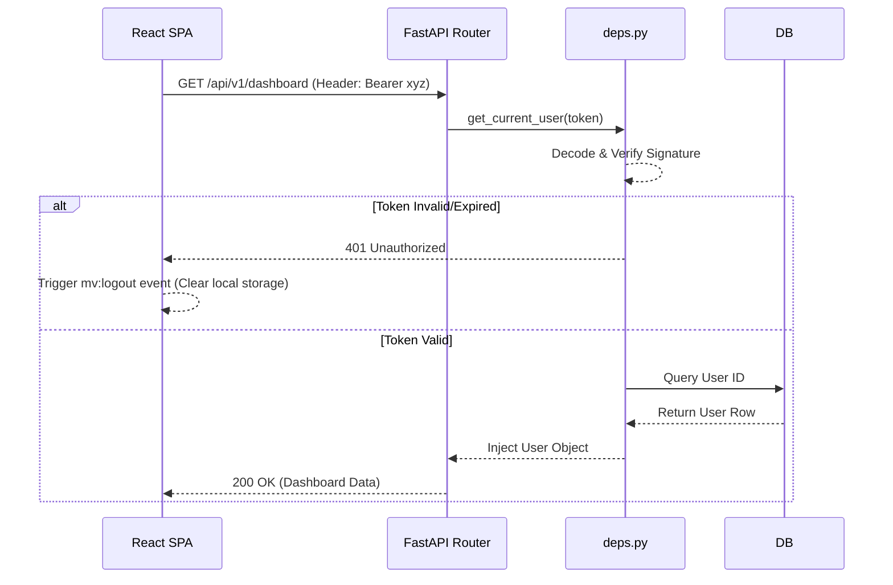

# Authentication System

## Overview & Architecture

Movientum utilizes a stateless, JWT-based (JSON Web Token) authentication system. This approach allows the API to scale horizontally without relying on server-side session stores. Passwords are securely hashed using `bcrypt` before being persisted in the Supabase PostgreSQL database.

---

## Logics & Business Rules

### Token Lifecycle
1. **Access Token**: Short-lived (default 48 hours). Used in the `Authorization: Bearer <token>` header for all protected API requests.
2. **Refresh Token**: Long-lived (default 7 days). Stored client-side and exchanged at the `/api/v1/auth/refresh` endpoint to obtain a new Access Token without requiring the user to log in again.

### Password Security
Raw passwords never touch the database. The `passlib[bcrypt]` library is used to generate a secure hash with a unique salt during registration. When logging in, the provided password is hashed and compared against the stored hash.

### Dependency Injection
FastAPI's dependency injection is used to secure endpoints. The `get_current_user` dependency automatically extracts the token from the header, decodes it, verifies the signature using `jwt_secret_key`, and checks expiration.

---

## Code Structure & Detailed Logic

### Core Components
- **`app/utils/security.py`**: Contains `verify_password`, `get_password_hash`, `create_access_token`, and `create_refresh_token`. Uses `PyJWT`.
- **`app/utils/deps.py`**: Contains the `get_current_user` FastAPI dependency.
- **`app/routers/auth.py`**: Exposes the REST endpoints:
  - `POST /register`: Creates a new user row with a hashed password.
  - `POST /login`: Validates credentials and returns JWT pair.
  - `POST /refresh`: Validates refresh token and issues a new access token.
  - `POST /logout`: Client-side operation (deletes token from localStorage), server can optionally blacklist.
  - `GET /me`: Returns the decoded profile of the current user.

---

## Tables & Summaries

### Auth Endpoints

| Endpoint | Method | Auth Required | Purpose |
|---|---|---|---|
| `/api/v1/auth/register` | `POST` | No | Creates a new user account. |
| `/api/v1/auth/login` | `POST` | No | Authenticates user, returns JWTs. |
| `/api/v1/auth/refresh` | `POST` | No (Requires Refresh Token) | Issues new Access Token. |
| `/api/v1/auth/me` | `GET` | **Yes** | Fetches active user profile. |
| `/api/v1/auth/logout` | `POST` | **Yes** | Invalidates active session. |

---

## Workflows & Lifecycles

### JWT Request Flow

