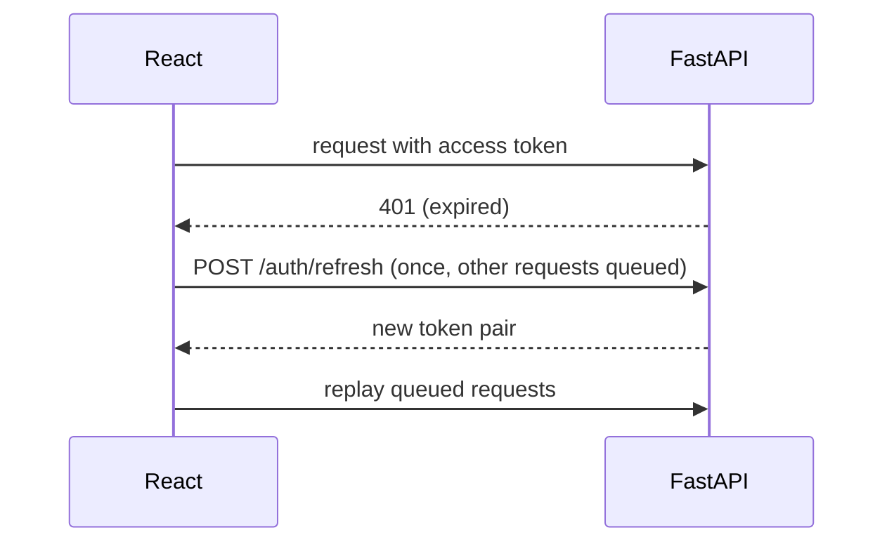

# Authentication

Movientum uses **JWT tokens**. The server keeps no session; each request carries a signed token that proves who the user is. Redis keeps a small blacklist so logged-out tokens stop working immediately.

## Ways to sign in

| Method | Endpoint | How it works |
|---|---|---|
| Email + password | `POST /api/v1/auth/register`, `/login` | Password hashed with bcrypt; only the hash is stored |
| Google | `POST /api/v1/auth/google` | The browser gets an ID token from Google; the server verifies it against Google's public keys (cached 6 h), then logs in, links to an existing email account, or creates a new user |
| Device login | `POST /api/v1/auth/device-login` | A logged-in user registers a device id (`/device-session`); later that device can log in without a password |

## The two tokens

| Token | Lifetime | Used for |
|---|---|---|
| Access token | 48 hours | Sent as `Authorization: Bearer ...` on every request |
| Refresh token | 7 days | Exchanged at `/auth/refresh` for a new pair |

Each token has a unique id (`jti`).

## Logout and refresh

- **Logout** writes the access token's `jti` to Redis as `auth:blacklist:{jti}`, set to expire when the token would have expired anyway.
- **Refresh** issues a new pair and blacklists the old refresh token, so it cannot be reused.
- Every request checks signature, expiry, and the blacklist.

## How endpoints are protected

`backend/app/utils/deps.py` provides three FastAPI dependencies:
- `get_current_user` — login required, 401 otherwise.
- `get_optional_user` — works for guests, personalises if logged in.
- `require_admin` — re-reads the user's role from the database, so promoting or demoting an admin takes effect without a new login.

The injected user is the decoded token (`{sub, email, username, role, ...}`), not a database row.

## Frontend side

```mermaid
sequenceDiagram
    participant UI as React
    participant API as FastAPI
    UI->>API: request with access token
    API-->>UI: 401 (expired)
    UI->>API: POST /auth/refresh (once, other requests queued)
    API-->>UI: new token pair
    UI->>API: replay queued requests
```

- Tokens are stored through `utils/storage.js`: `localStorage` if "Remember me", otherwise `sessionStorage`.
- If refresh fails, `AuthContext` logs the user out.

## Known weakness

`POST /auth/reset-password` resets a password by email without verifying ownership. Treat it as a gap to close, not a feature to copy.
