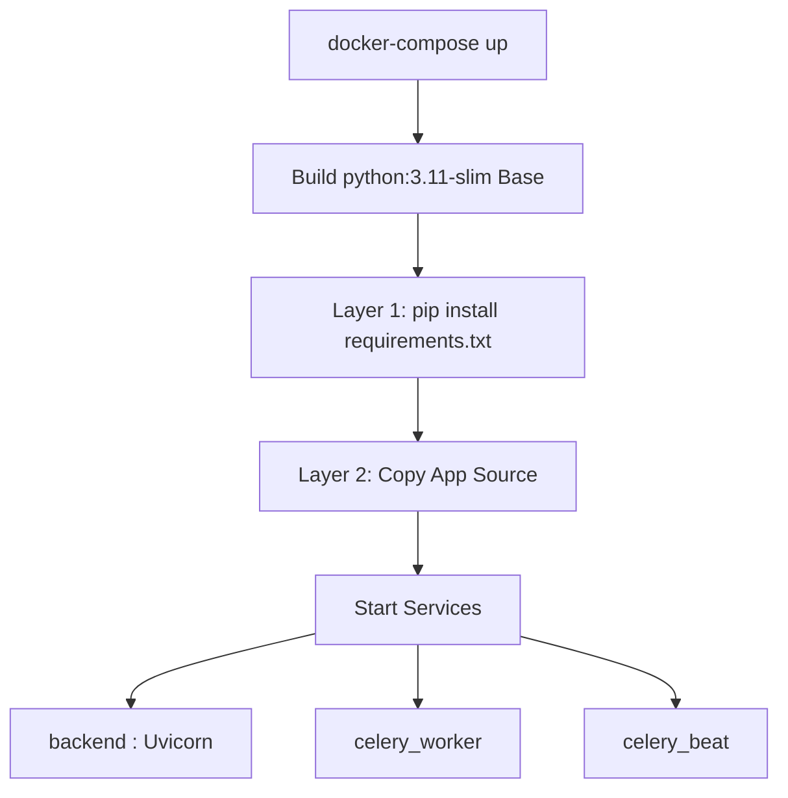

# Docker Setup & Containerization

## Overview & Architecture

Movientum's backend is fully containerized using Docker, allowing consistent environments across development, testing, and production. The setup heavily leverages `docker-compose` to orchestrate the FastAPI backend alongside asynchronous Celery workers and beat schedulers.

---

## Logics & Business Rules

### Container Architecture
The architecture strictly separates the API request cycle from background processing:
1. **API Server (`backend`)**: Handles all synchronous and `asyncio` user-facing HTTP requests via Uvicorn.
2. **Task Worker (`celery_worker`)**: Dedicated Celery instance for heavy background jobs (e.g., TMDB data ingestion, model retraining inference).
3. **Task Scheduler (`celery_beat`)**: Dedicated Celery Beat instance triggering recurring tasks (e.g., Nightly XGBRanker Retraining at 3:30 AM).

### Caching Dependencies Strategy
The `Dockerfile` employs a multi-step build process to maximize layer caching. `requirements.txt` is copied and installed *before* the application code. This ensures that changing a Python file does not invalidate the expensive `pip install` layer.

### Forced Rebuild Trigger
To overcome aggressive Docker caching in CI/CD pipelines when code changes but dependencies don't, the `Dockerfile` uses an `ARG CODE_VERSION` invalidation trick.

---

## Code Structure & Detailed Logic

### The Dockerfile
The base image is a minimal `python:3.11-slim` to keep image size small.
```dockerfile
FROM python:3.11-slim

WORKDIR /app
ENV PYTHONUNBUFFERED=1

# ---- 1. Cache dependencies ONLY ----
COPY requirements.txt .
RUN pip install --no-cache-dir -r requirements.txt

# ---- 2. Force rebuild for backend code ----
ARG CODE_VERSION=1
ENV CODE_VERSION=$CODE_VERSION

# ---- 3. Copy all backend code (always fresh) ----
COPY . /app

# ---- 4. Run app ----
EXPOSE 8000
CMD ["sh", "-c", "echo Running build: $CODE_VERSION && uvicorn app.main:app --host 0.0.0.0 --port ${PORT:-8000}"]
```

### The Docker Compose Configuration
The `docker-compose.yml` mounts local volumes `.:/app` for hot-reloading during development.
```yaml
services:
  backend:
    build: .
    command: uvicorn app.main:app --reload --host 0.0.0.0 --port 8000
    volumes:
      - .:/app
    env_file:
      - .env
    ports:
      - "8000:8000"

  celery_worker:
    build: .
    command: celery -A app.celery_app worker --loglevel=info
    volumes:
      - .:/app
    env_file:
      - .env
    depends_on:
      - backend

  celery_beat:
    build: .
    command: celery -A app.celery_app beat --loglevel=info
    volumes:
      - .:/app
    env_file:
      - .env
    depends_on:
      - backend
```

---

## Tables & Summaries

### Container Services
| Service | Image | Command | Port | Volume |
|---|---|---|---|---|
| `backend` | local build | `uvicorn app.main:app --reload` | `8000:8000` | `.:/app` |
| `celery_worker` | local build | `celery worker` | None | `.:/app` |
| `celery_beat` | local build | `celery beat` | None | `.:/app` |

---

## Workflows & Lifecycles

### Local Development Startup Flow

