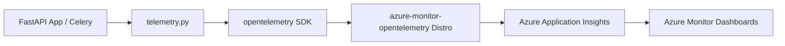

# Azure Monitor & OpenTelemetry

## Overview & Architecture

Movientum bypasses local Prometheus/Grafana stacks in favor of a fully managed cloud observability suite via **Azure Monitor Application Insights**. 

The backend application is instrumented using the `opentelemetry-api` and the `azure-monitor-opentelemetry` distro. This setup automatically collects system metrics (CPU, Memory, HTTP routes) and custom business logic metrics (ML pipeline latencies, graph counts, caching hits).

---

## Logics & Business Rules

### Instrument Types Used
- **Histograms**: For tracking durations and distributions (e.g., `xgb_inference_seconds`, `taste_profile_update_seconds`).
- **Counters**: For cumulative tracking (e.g., `feedback_signals_total`, `cache_operations_total`).
- **Observable Gauges**: For capturing current point-in-time state that fluctuates up and down (e.g., `graph_node_count`, `retrain_rows_trained`). These rely on registered generator callbacks.

### Initialization & Graceful Degradation
Telemetry is initialized on startup. If `APPLICATIONINSIGHTS_CONNECTION_STRING` is missing from the environment, the system gracefully degrades, logging a warning but continuing to function normally without crashing.

---

## Code Structure & Detailed Logic

### OpenTelemetry Configuration (`telemetry.py`)
```python
from opentelemetry import metrics
from azure.monitor.opentelemetry import configure_azure_monitor

def init_telemetry():
    connection_string = os.getenv("APPLICATIONINSIGHTS_CONNECTION_STRING")
    if not connection_string:
        return False

    configure_azure_monitor(connection_string=connection_string)
    _init_instruments()
    return True
```

### Observable Gauge Implementation Pattern
Observable Gauges require global state variables and generator callbacks that yield `metrics.Observation`.
```python
_graph_node_count = 0

def set_graph_node_count(val: int):
    global _graph_node_count
    _graph_node_count = val

def _observe_graph_node_count(options):
    yield metrics.Observation(_graph_node_count)

# In _init_instruments():
meter.create_observable_gauge(
    name="movientum_graph_node_count",
    callbacks=[_observe_graph_node_count],
    description="Current number of nodes in the in-memory NetworkX graph"
)
```

---

## Tables & Summaries

### Custom Metric Instruments

| Category | Instrument Name | Type | Description |
|---|---|---|---|
| **ML Inference** | `movientum_rwr_seconds` | Histogram | Time for NetworkX personalized PageRank |
| **ML Inference** | `movientum_xgb_inference_seconds` | Histogram | Time for XGBRanker.predict() |
| **ML Inference** | `movientum_feature_matrix_build_seconds`| Histogram | Time to build (N×16) feature matrix |
| **ML Inference** | `movientum_xgb_coldstart_total` | Counter | Fallbacks to PPR score (no trained model) |
| **Graph** | `movientum_graph_node_count` | Obs. Gauge | Current nodes in the NetworkX graph |
| **Graph** | `movientum_graph_edge_count` | Obs. Gauge | Current edges in the NetworkX graph |
| **Graph** | `movientum_graph_rebuild_duration_seconds` | Histogram | Time taken to build the graph from DB |
| **Retraining** | `movientum_retrain_total` | Counter | Retrain outcomes (success, error, skipped) |
| **Retraining** | `movientum_retrain_duration_seconds` | Histogram | Wall-clock time for the nightly retrain |
| **Retraining** | `movientum_retrain_rows_trained` | Obs. Gauge | Interaction logs used in last retrain |
| **Feedback** | `movientum_feedback_signals_total` | Counter | Thumbs/Clicks processed |
| **Feedback** | `movientum_taste_profile_update_seconds`| Histogram | Time to update UserTasteProfile weights |

---

## Workflows & Lifecycles

### Observability Pipeline Flow

