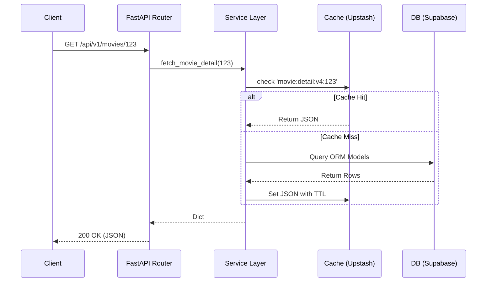

# API Endpoints List

## Overview & Architecture

Movientum's backend API is organized as a Modular Monolith built on FastAPI. The endpoints are strictly versioned under `/api/v1/` and logically grouped into distinct routers mounted in `backend/app/main.py`.

The API architecture heavily leverages FastAPI's Dependency Injection (`Depends`) to provide asynchronous database sessions (`get_db`) and authentication state (`get_current_user_id`).

---

## Logics & Business Rules

### Authentication & Authorization
- **Public Routes**: Accessible by any client.
- **Protected Routes**: Require a valid JWT Bearer token in the `Authorization` header. Implemented via the `get_current_user_id` dependency, which raises a `401 Unauthorized` if missing or invalid.
- **Admin Routes**: E.g., `/api/v1/internal/*` requires a specific `cron_secret_token` or Admin role check.

### Caching
Many `GET` endpoints are wrapped in Upstash Redis cache checks (e.g., `movie:detail:{id}`). If a cache miss occurs, an `asyncio.Event` lock protects against cache stampedes while the DB is queried.

---

## Tables & Summaries

### Active API Routers

| Prefix | Router File | Description |
|---|---|---|
| `/api/v1/movies` | `movies.py` | Catalog browsing, trending, movie details, similar movies. |
| `/api/v1/tv` | `tv.py` | TV show details, seasons, episodes, similar shows. |
| `/api/v1/auth` | `auth.py` | JWT registration, login, logout, and token refresh. |
| `/api/v1/search` | `search.py` | Instant and paginated search across movies, TV, and people. |
| `/api/v1/ratings` | `ratings.py` | User submissions of 4-category ratings (skip, timepass, go_for_it, perfection). |
| `/api/v1/watch` | `watch.py` | Marking items as watched/unwatched in the user's history. |
| `/api/v1/recommendations` | `recommendations.py` | Fetching personalized feeds based on taste profiles + RWR graph. |
| `/api/v1/rec-feedback` | `recommendation_signals.py` | Sending thumbs-up/down explicit ML signals. |
| `/api/v1/person` | `person.py` | Actor/director details and their filmography. |
| `/api/v1/clicks` | `clicks.py` | Implicit interaction logging (decaying weight feedback). |
| `/api/v1/users` | `users.py` | User taste profile fetching and taste analysis metrics. |
| `/api/v1/news` | `news.py` | Aggregated and personalized entertainment news feeds. |
| `/api/v1/trailers` | `trailers.py` | Fetching YouTube trailer keys for frontend display. |
| `/api/v1/watchlists` | `watchlist.py` | Multi-watchlist collections and item management. |
| `/api/v1/watching-tracker` | `watching_tracker.py` | Tracking ongoing TV show progress. |
| `/api/v1/temp-tracker` | `temp_tracker.py` | Temporary tracking for items users might want to watch. |
| `/api/v1/notifications` | `notifications.py` | Alerting users about new episodes or system updates. |
| `/api/v1/feedback` | `feedback.py` | General site UI/UX feedback submission. |
| `/api/v1/requests` | `requests.py` | Submitting requests for missing content (Rating Needed). |
| `/api/v1/internal` | `internal.py` | Cron-triggered jobs (e.g., ML retrain triggers, cleanup). |

---

## Workflows & Lifecycles

### Typical Request Flow

