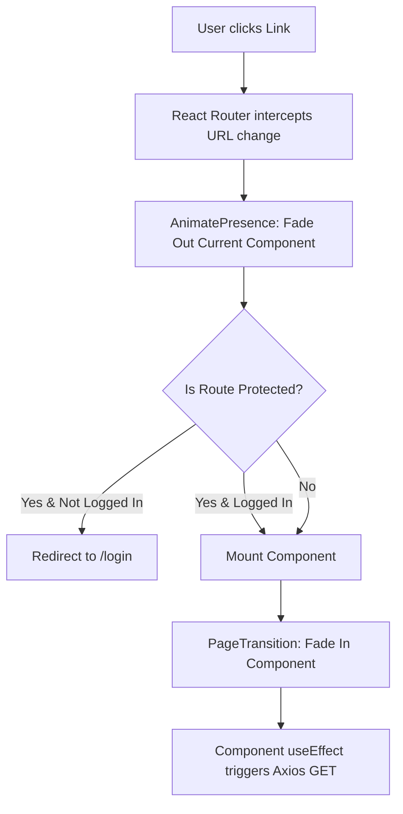

# Website & Frontend Overview

## Overview & Architecture

Movientum's frontend is a Client-Side Rendered (CSR) Single Page Application (SPA) built with React 19 and Vite. The UI is designed to be cinematic, fluid, and highly interactive, heavily utilizing `framer-motion` (`motion/react`) for page transitions and micro-interactions. 

All routing is handled strictly on the client-side via `react-router-dom`, connecting to the FastAPI backend asynchronously via `axios`.

---

## Logics & Business Rules

### Authentication State (Context)
The `AuthProvider` (`src/context/AuthContext.jsx`) globally wraps the application. 
- It maintains the `isLoggedIn` state and handles JWT storage (in `localStorage`).
- An `api.js` Axios interceptor listens for `401 Unauthorized` responses and fires a global `mv:logout` event, which the `App.jsx` router catches to forcefully boot the user to the login page.

### Protected Routes
Components that require an active session (e.g., Dashboard, Settings, Recommendations) are wrapped in a `<ProtectedRoute>` component. If an anonymous user attempts to access them, they are redirected to `/login`.

---

## Code Structure & Detailed Logic

### Active Routes (`frontend/src/App.jsx`)

| Route Path | Component | Auth Required? | Description |
|---|---|---|---|
| `/` or `/intro` | `Intro.jsx` | No | Landing page with cinematic entry. Redirects to `/home` if already logged in. |
| `/home` | `Home.jsx` | No | Main landing page featuring trending carousels. |
| `/movies`, `/tv` | `MovieList.jsx` | No | Generic browse lists. |
| `/movies/:id`, `/tv/:id` | `MovieDetail.jsx`, `TVDetail.jsx` | No | Detailed entity view (credits, similar, trailers). |
| `/person/:id` | `PersonPage.jsx` | No | Actor/Director filmography. |
| `/company/:id`, `/country/:iso`| `CompanyPage.jsx`, `CountryPage.jsx`| No | Specialized browsing filters. |
| `/search`, `/explore` | `Search.jsx`, `Explore.jsx` | No | Deep search and advanced filtering interfaces. |
| `/login`, `/register` | `Login.jsx`, `Register.jsx` | No | Auth flows. |
| `/dashboard` | `Dashboard.jsx` | **Yes** | User hub: watch history, ratings, watchlists. |
| `/recommendations` | `Recommendations.jsx` | **Yes** | Core personalized ML feed (XGBRanker output). |
| `/rec-content` | `RecommendationsContent.jsx`| No | "Find Similar" tool (Content Basket RWR blending). |
| `/watchlists/:id` | `WatchlistDetail.jsx` | **Yes** | Detailed view of a specific custom watchlist. |
| `/analysis` | `Analysis.jsx` | **Yes** | Visual breakdown of user's taste profile. |
| `/news` | `News.jsx` | No | Aggregated entertainment news feed. |
| `/settings/*` | `Settings.jsx` (Nested) | **Yes** | Profile management, password reset, data export. |
| `/admin` | `AdminDashboard.jsx` | **Yes** (Admin) | System metrics and internal controls. |

### Global UI Elements
- **`Navbar.jsx`**: Global sticky navigation.
- **`PageTransition.jsx`**: Wraps every `<Route>` element to provide fluid cross-fade animations during client-side navigation.
- **`ErrorBoundary.jsx`**: Catches React rendering crashes to display a fallback UI instead of a blank white screen.

---

## Tables & Summaries

### UI Libraries Used
| Library | Purpose |
|---|---|
| `react-router-dom` | Client-side URL mapping. |
| `motion/react` | Page transitions, presence detection, hover physics. |
| `ogl` | Minimal WebGL library for advanced cinematic effects. |
| `react-icons` | Unified icon system. |

---

## Workflows & Lifecycles

### Frontend Routing Lifecycle

