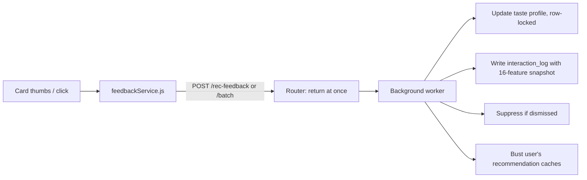

# Feedback Loop (How Recommendations Learn)

Every time a user reacts to a title, two things happen: their **taste profile** shifts right away, and a **training row** is saved for the nightly model.

## Signals and their effect

Constants live in `backend/app/services/feedback_labels.py`.

| Signal | Where it comes from | Genre | Cast / Crew / Era | Keyword | Language | Training label |
|---|---|---|---|---|---|---|
| Watched | "Mark watched" | +15 | +10 | +8 | +2 | 5 |
| Thumbs up | Any card | +10 | +10 | +5 | +1 | 4 |
| Added to watchlist | Watchlist button | +8 | +5 | +4 | +1 | 4 |
| Click | Opening a recommended card | +2 | — | +1 | +0.2 | 3 |
| Removed from watchlist | | −8 | −5 | −4 | −1 | 2 |
| Un-watched | | −15 | −10 | −8 | −2 | 2 |
| Thumbs down | Any card | −15 | −15 | −8 | −1.5 | 1 |

- **Explicit** signals (thumbs, watched, watchlist) never fade.
- **Clicks** fade over time (half-life about 69 days).
- Thumbs down and un-watched also add to `negative_weights`, a soft penalty used when scoring.
- Weights are not clamped; scorers normalise by the user's own peak value.

## Suppression ("don't show me this")

A thumbs down on a card also adds the title to `rec_suppression` for **90 days**. Its weight fades from 1.0 to about 0.1 over that time. Recommendation queries skip suppressed titles in the same query that skips watched ones, so this costs no extra database trip.

## Request path

- Clicks are batched on the client (up to 20 per request) and deduplicated.
- The router returns immediately; `feedback_signal_worker.py` does the work after the response.
- `source` records which surface sent it (For You, More Like This, AI, trailers, …).
- AI card thumbs also write `ai_rec_memory`, so Gemini will not suggest that title again.
- News thumbs are separate and never touch the taste profile.

## Why labels start at 1, not −1

XGBRanker's `rank:ndcg` needs non-negative labels. With a −1 label floored to 0, a thumbs down trained the same as "removed from watchlist". Shifting the scale keeps dislikes strictly below neutral. Dislike rows also get 1.5× sample weight because they are rare.

## Rebuilding a profile

`feedback_service.rebuild_taste_profile_from_history` recomputes a profile from watch history and watchlist — used after CSV imports and for repairs.
