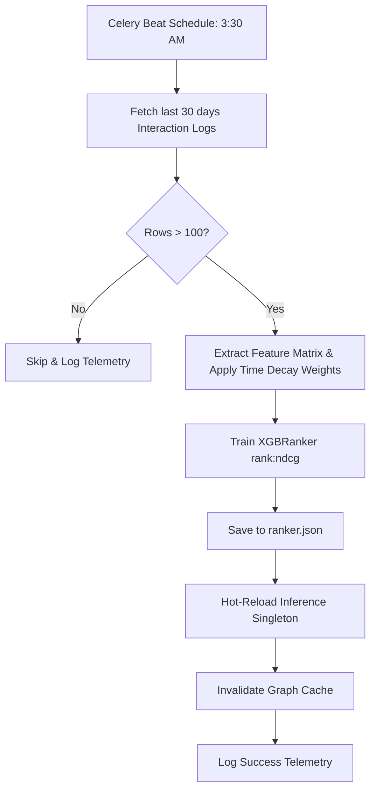

# Nightly XGBRanker Retraining Pipeline (Phase 7)
*(Note: MLflow tracking was bypassed/removed in favor of direct disk artifact saves and OpenTelemetry metrics for simplicity and lower infrastructure overhead.)*

## Overview & Architecture

### Goal
A Celery beat task runs nightly at 3:30 AM IST to rebuild the `XGBRanker` recommendation model based on user interactions collected over the last 30 days. The resulting model is saved locally to `ranker.json`, hot-reloaded into memory, and the graph cache is invalidated to ensure the freshest catalog items are used in the next request.

---

## Code Structure & Algorithms

### 1. Training Data Assembly
The pipeline begins in `backend/app/ml/training.py` by pulling `InteractionLog` rows from the past 30 days (`_LOOKBACK_DAYS = 30`).
```python
cutoff = datetime.now(timezone.utc) - timedelta(days=_LOOKBACK_DAYS)
result = await db.execute(
    select(InteractionLog)
    .where(InteractionLog.timestamp >= cutoff)
    .order_by(InteractionLog.user_id, InteractionLog.timestamp)
)
logs = result.scalars().all()
```
- **Label Generation**: The explicit raw labels (`log.label`) are used as targets (`-1`, `0`, `2`, `3`).
- **Sample Weighting (Time Decay)**: An exponential time-decay weight is applied based on the timestamp.
  `decay = time_decay_weight(log.timestamp)`
- **Feature Extraction**: The 16-dimensional `feature_snapshot` attached to the `InteractionLog` is extracted to build the feature matrix `X`.
- **Group Tracking**: Rows are grouped by `user_id` so that `XGBRanker` can optimize ranking *within* individual user sessions.

### 2. Train/Validation Split
The dataset is split such that the last 15% of user groups (`_VAL_FRACTION = 0.15`) are strictly held out for validation, preserving the ranking query groups.
```python
n_groups = len(groups)
val_groups_count = max(1, int(n_groups * _VAL_FRACTION))
train_groups_count = n_groups - val_groups_count
```

### 3. XGBRanker Training
The model is trained using the `rank:ndcg` objective to optimize the top-K ranking quality, with early stopping enabled.
```python
ranker = XGBRanker(
    objective        = "rank:ndcg",
    n_estimators     = 300,
    max_depth        = 6,
    learning_rate    = 0.05,
    subsample        = 0.8,
    colsample_bytree = 0.8,
    tree_method      = "hist",
    eval_metric      = "ndcg@10",
    early_stopping_rounds = 20,
    verbosity        = 0,
)

ranker.fit(
    X_train, y_train,
    group = train_groups,
    sample_weight = group_weights,
    eval_set = [(X_val, y_val)],
    eval_group = [val_groups],
    verbose = False,
)
```

### 4. Artifact Save & Hot-Reload
Instead of pushing to a remote MLflow registry, the model is serialized directly to the local filesystem (`backend/app/ml/ranker.json`).
```python
ranker.save_model(MODEL_PATH)
```
The application then calls `reload_ranker()` to instruct the inference singleton (in `ranker.py`) to drop the old model and load the fresh `ranker.json` from disk, all without requiring a server restart.

### 5. Graph Invalidation
Finally, `invalidate_graph()` is called. This clears the `graph_cache.py` singleton, forcing the bipartite content graph to rebuild from the database on the next user request, thus integrating any newly ingested TMDB items.

---

## Tables & Summaries

### Telemetry (OpenTelemetry) Metrics Logged
Instead of MLflow, the retraining job logs to AppInsights via `app.telemetry`:
| Metric | Type | Description |
|---|---|---|
| `retrain_status` | Counter | Incremented with tags `{"status": "success" \| "error_fit_failed" \| "skipped_insufficient_data"}`. |
| `retrain_duration` | Histogram | Time (in seconds) taken to execute the retraining pipeline. |
| `set_retrain_rows` | Gauge | Total number of rows used for training (`len(X_train)`). |
| `set_retrain_best_iter` | Gauge | The `best_iteration` achieved by early stopping. |

### Minimum Data Requirements
- **`_MIN_ROWS_TO_TRAIN`**: 100 rows. If fewer than 100 interaction logs exist in the 30-day window, the training job skips execution and emits a `skipped_insufficient_data` telemetry event.

---

## Workflows & Lifecycles

### Retraining Execution Flow

