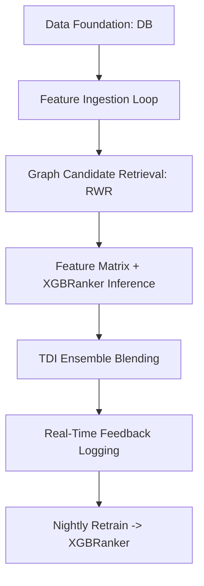
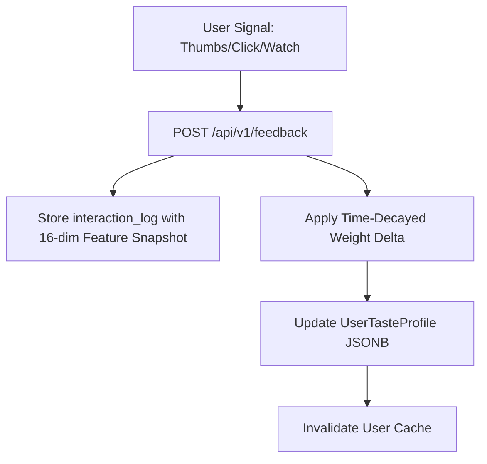

# Movientum — Advanced Recommendation Engine

## Overview & Architecture

### System Overview
Movientum's advanced recommendation engine represents a full ML-grade personalized system running on FastAPI + SQLAlchemy, Supabase PostgreSQL, Upstash Redis, Celery, and a React SPA frontend.

The engine uses a 6-tier architecture:
1. **Tier 1 (Data Foundation)**: Fast local `content_catalog` and live `user_taste_profiles`.
2. **Tier 2 (Feature Ingestion)**: Cache-on-demand TMDB fallback + DB backfill.
3. **Tier 3 (Graph Candidate Retrieval)**: Bipartite Content Graph enabling Random Walk with Restart (RWR).
4. **Tier 4 (Feature Matrix & Inference)**: `XGBRanker` prediction using static, personalized, and structural overlap features.
5. **Tier 5 (Ensemble Blending)**: Team-Draft Interleaving (TDI) blending the new ML output with existing baseline models.
6. **Tier 6 (Feedback & Retraining)**: Real-time user interaction signals (including watch history parsing) feeding a nightly automated model retrain via Celery.

---

## Logics & Business Rules

### Graph Construction & Edge Weights (Phase 3)
Nodes include Content, Genre, Keyword, Talent, Era, and Language. Edge weights reflect predictive importance:
- Director = `2.5` (strongest creative signal)
- Keyword = `1.5` (thematic specificity)
- Genre = `1.0` (baseline)
- Cast = `0.8`
- Era = `0.6`
- Language = `0.4`

### Interaction Signal Scoring (Phase 6)
Explicit signals have no time decay applied (`λ=0`), whereas implicit signals decay exponentially (`λ=0.01`, half-life ≈ 69 days). All profile weights are clamped to `[-100, 100]`.
- **👍 Thumbs Up**: Label 3 | `{"genres": +10.0, "cast": +10.0, "crew": +10.0, "era": +10.0, "keyword": +5.0, "language": +1.0}`
- **👎 Thumbs Down**: Label -1 | `{"genres": -15.0, "cast": -15.0, "crew": -15.0, "era": -15.0, "keyword": -8.0, "language": -1.5}`
- **🖱️ Poster Click (Decaying)**: Label 2 | `{"genres": +2.0, "keyword": +1.0, "language": +0.2}`
- **👁️ Watched**: Label 4 | `{"genres": +15.0, "cast": +10.0, "crew": +10.0, "era": +10.0, "keyword": +8.0, "language": +2.0}`
- **👁️ Unwatched**: Label 0 | `{"genres": -15.0, "cast": -10.0, "crew": -10.0, "era": -10.0, "keyword": -8.0, "language": -2.0}`
- **📌 Watchlist**: Label 3 | `{"genres": +8.0, "cast": +5.0, "crew": +5.0, "era": +5.0, "keyword": +4.0, "language": +1.0}`
- **📌 Unwatchlist**: Label 0 | `{"genres": -8.0, "cast": -5.0, "crew": -5.0, "era": -5.0, "keyword": -4.0, "language": -1.0}`

### Taste Profile Rebuilding
The backend can fully rebuild a `UserTasteProfile` from scratch using their historical `WatchHistory` and `Watchlist` rows in the database (via `rebuild_taste_profile_from_history`), guaranteeing accurate cold-start personalization.

---

## Code Structure & Algorithms

### Phase 1: ORM Models
Defined in `backend/app/db/orm_models.py`.

#### `ContentCatalog`
Uses `ARRAY(Integer)` and `JSONB` for high-speed candidate filtering.
```python
tmdb_id        = Column(Integer, nullable=False)
media_type     = Column(String(10), nullable=False)
genre_ids      = Column(ARRAY(Integer), default=[])
keyword_ids    = Column(ARRAY(Integer), default=[])
cast_ids       = Column(ARRAY(Integer), default=[])
crew_ids       = Column(JSONB, default={}) # {"director": [id], "writer": [id]}
original_language = Column(String(10))
release_era       = Column(String(20))
vote_average   = Column(Float, default=0.0)
popularity     = Column(Float, default=0.0)
```

#### `UserTasteProfile`
Stores multi-dimensional preference scorecards as JSONB maps. Keys are TMDB IDs (strings), values are clamped floats.
```python
genre_weights    = Column(JSONB, default={})
cast_weights     = Column(JSONB, default={})
crew_weights     = Column(JSONB, default={})
keyword_weights  = Column(JSONB, default={})
language_weights = Column(JSONB, default={})
era_weights      = Column(JSONB, default={})
negative_weights = Column(JSONB, default={}) # Populated by thumbs_down & unwatched
```

#### `InteractionLog`
Records every recommendation feedback signal to generate the nightly training dataset.
```python
user_id          = Column(UUID(as_uuid=True), ForeignKey("users.id"))
tmdb_id          = Column(Integer, nullable=False)
media_type       = Column(String(10), nullable=False) 
signal_type      = Column(String(20), nullable=False) 
label            = Column(Integer, nullable=False) 
feature_snapshot = Column(JSONB, default={}) # The 16-dim feature vector at time of interaction
timestamp        = Column(DateTime(timezone=True), default=utcnow)
```

### Phase 3 & 4: Inference Pipeline (`advanced_recs.py`)
1. Ensure the seed item is in the catalog (using `ingest_item_to_catalog`).
2. Load the cached `nx.Graph` singleton from `graph_cache.py`.
3. Run `get_rwr_candidates` to fetch candidate node IDs.
4. Construct a 16-feature `numpy.ndarray` matrix matching the candidates against the user's `UserTasteProfile`.
5. Run `rank_candidates(feature_matrix)` using the `XGBRanker` wrapper in `ranker.py`. If cold-started, fall back to sorting by `ppr_score` (column 0).

---

## Tables & Summaries

### Feature Matrix Columns (16 Features)
| Feature Name | Source | Description |
|---|---|---|
| `ppr_score`, `ppr_rank_norm` | Graph RWR | Network visit probability & normalized rank |
| `vote_average`, `vote_count_log`, `popularity_log`, `recency_score` | Catalog | Static performance indices |
| `user_genre_score`, `user_cast_score`, `user_crew_score`, `user_keyword_score`, `user_era_score`, `user_language_mult` | Taste Profile | Personalized affinities |
| `genre_overlap_count`, `cast_overlap_count`, `same_language`, `same_era` | Catalog | Structural overlap with origin item |

---

## Workflows & Lifecycles

### Architecture Flow


### Real-Time Feedback Flow

