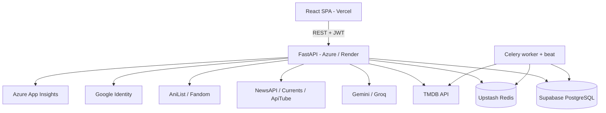

# System Integration

How each part of Movientum connects to the others, and what flows across each connection.

## Frontend → Backend

- One Axios client (`utils/api.js`) with bearer token, 401 refresh-and-retry, 120 s timeout, and failover to the backup backend.
- One service file per backend area (`services/*.js`). Full mapping: `AI_Context/API_MAP.md`.
- Page loads use `/api/v1/pages/*` bundles; later refetches (filters, after a change) use the individual endpoints.

## Backend → PostgreSQL

- SQLAlchemy 2 async with `asyncpg`; one session per request via `get_db()`.
- Movies and TV share `movies`, keyed by `(id, type)` — join on both.
- Migrations with Alembic (psycopg2 URL). Four tables are created in `main.py` instead.

## Backend → Redis

| Use | Keys |
|---|---|
| Response cache | Built by `key_*` functions in `db/cache.py` |
| Page bundles | `page:*` |
| Token blacklist | `auth:blacklist:{jti}` |
| News storage | `news:v3:*` |
| Trailer index | per-region index keys |
| Celery broker/backend | Celery's own keys |

## Backend → TMDB

- `tmdb_service.py`: one shared HTTP client with rate limiting, retries, timeouts; the TLS connection is opened at startup.
- Titles fetched on demand are saved to `movies` and ingested into `content_catalog` in the background.
- TMDB responses (credits, videos, providers, collections) are cached 7 days.
- Persistence thresholds (`utils/persistence.py`) decide which fetched titles are worth saving.

## Backend → News providers

Only the admin-triggered **News Daily Fetch** calls them (about 36 requests per run). Results are enriched and stored as a Redis snapshot. See `../features/news_integration.md`.

## Backend → LLMs

`ai_rec_service.py` calls Gemini first, then each Groq model in turn if Gemini fails. Suggestions are matched to real TMDB titles before returning.

## Backend → Character sources

`character_service.py` for tier lists: AniList (Japanese anime) → Fandom wiki (other animation) → TMDB cast (fallback).

## Background jobs

Two ways to run the same code:
1. **Celery beat** schedules (IST): sync 03:00, retrain 03:30, title index 03:45, episodes 04:00, trailers every 3 h.
2. **Admin trigger**: `/internal/trigger/{task}` runs the coroutine inside the API with `BackgroundTasks` — no Celery needed. This is the dependable path on free hosting.

## Inside the backend: recommendation pieces

| Module | Talks to |
|---|---|
| `graph_cache.py` | Reads `content_catalog`, holds the graph in memory |
| `advanced_recs.py` | Graph + `user_taste_profiles` + `ml/ranker.py` |
| `recommendation_service.py` | Seeds from `watch_history`/`watchlist`, calls `advanced_recs`, blends |
| `feedback_service.py` | Writes `user_taste_profiles`, `interaction_log`, `rec_suppression` |
| `ml/training.py` | Reads `interaction_log`, writes `ranker.json` + `ranker_meta.json` |
| `news_ranking_service.py` | Reads `user_taste_profiles` (never writes) |

## Not integrated

`fedpcl/` is a separate research project (federated learning paper reproduction). The app does not import it.
